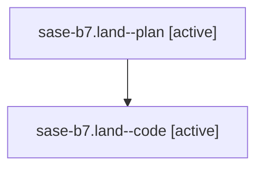

# Family: sase-b7.land

[Agent Hoods](../README.md) / [bbugyi200](../users/bbugyi200/README.md) / [athena](../users/bbugyi200/machines/athena/README.md) / [sase-b7](../users/bbugyi200/machines/athena/hoods/sase-b7/README.md) / sase-b7.land

Owner: `bbugyi200.athena` · Hood: `sase-b7` · Members: 2

## Lineage

The diagram is an optional enhancement; the ordered table below contains the same lineage in accessible text.

| Role | Agent | State | Model / provider | Timing | Commits | Prompt | Chat |
|---|---|---|---|---|---:|---|---|
| plan | sase-b7.land--plan | active | opus / claude | 2026-07-30T14:34:44.651889+00:00 | 0 | [Prompt](../agents/bbugyi200.athena.sase-b7.land--plan/prompt.md) | [Chat](../agents/bbugyi200.athena.sase-b7.land--plan/chat.md) |
| code | sase-b7.land--code | active | gpt-5.6-sol / codex | 2026-07-30T14:52:00.614213+00:00 | 0 | — | — |

## Neighbors

| Agent | Relation | State |
|---|---|---|
| [sase-b7.1](../agents/bbugyi200.athena.sase-b7.1/README.md) | sase-b7 hood | active |
| [sase-b7.2](../agents/bbugyi200.athena.sase-b7.2/README.md) | sase-b7 hood | active |
| [sase-b7.3](../agents/bbugyi200.athena.sase-b7.3/README.md) | sase-b7 hood | active |
| [sase-b7.4](../agents/bbugyi200.athena.sase-b7.4/README.md) | sase-b7 hood | active |
| [sase-b7.4.w4](../agents/bbugyi200.athena.sase-b7.4.w4/README.md) | sase-b7 hood | active |
| [sase-b7.4.w5](bbugyi200.athena.sase-b7.4.w5.md) (family · 2) | sase-b7 hood | active 2 |
| [sase-b7.4.w6](../agents/bbugyi200.athena.sase-b7.4.w6/README.md) | sase-b7 hood | active |
| [sase-b7.4.w7](../agents/bbugyi200.athena.sase-b7.4.w7/README.md) | sase-b7 hood | active |
| [sase-b7.5](../agents/bbugyi200.athena.sase-b7.5/README.md) | sase-b7 hood | active |
