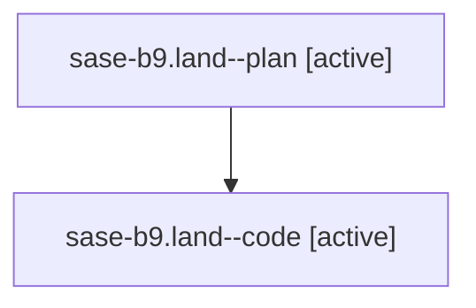

# Family: sase-b9.land

[Agent Hoods](../README.md) / [bbugyi200](../users/bbugyi200/README.md) / [athena](../users/bbugyi200/machines/athena/README.md) / [sase-b9](../users/bbugyi200/machines/athena/hoods/sase-b9/README.md) / sase-b9.land

Owner: `bbugyi200.athena` · Hood: `sase-b9` · Members: 2

## Lineage

The diagram is an optional enhancement; the ordered table below contains the same lineage in accessible text.

| Role | Agent | State | Model / provider | Timing | Commits | Prompt | Chat |
|---|---|---|---|---|---:|---|---|
| plan | sase-b9.land--plan | active | gpt-5.6-sol / codex | 2026-07-30T16:51:16.295766+00:00 | 0 | [Prompt](../agents/bbugyi200.athena.sase-b9.land--plan/prompt.md) | [Chat](../agents/bbugyi200.athena.sase-b9.land--plan/chat.md) |
| code | sase-b9.land--code | active | gpt-5.6-sol / codex | 2026-07-30T17:01:46.557108+00:00 | [2](../agents/bbugyi200.athena.sase-b9.land--code/README.md#commits) | — | — |

## Commits

| Role | Repo | Commit | Subject | Committed |
|---|---|---|---|---|
| code | sase | [`d6eb412`](https://github.com/sase-org/sase/commit/d6eb4127138b071e02e179b4cd8bf0c1da7c9948) | fix(artifact): protect consumed files from retention | 2026-07-30 13:09:26 EDT |
| code | sase | [`be94f09`](https://github.com/sase-org/sase/commit/be94f098a761cee54e5e4b855374b504b92f6eb8) | fix(artifact): extend consumption protection coverage | 2026-07-30 13:52:03 EDT |

## Neighbors

| Agent | Relation | State |
|---|---|---|
| [sase-b9.1](../agents/bbugyi200.athena.sase-b9.1/README.md) | sase-b9 hood | completed |
| [sase-b9.2](../agents/bbugyi200.athena.sase-b9.2/README.md) | sase-b9 hood | completed |
| [sase-b9.3](../agents/bbugyi200.athena.sase-b9.3/README.md) | sase-b9 hood | completed |
| [sase-b9.4](../agents/bbugyi200.athena.sase-b9.4/README.md) | sase-b9 hood | completed |
