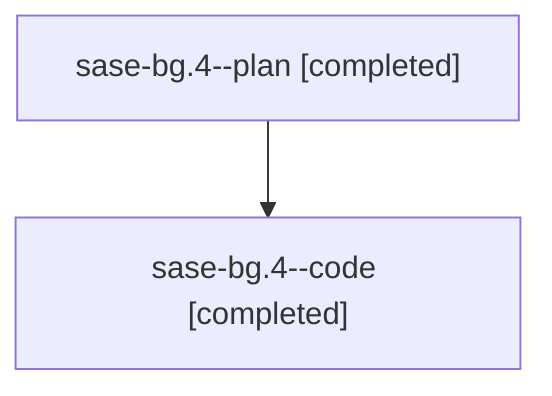

# Family: sase-bg.4

[Agent Hoods](../README.md) / [bbugyi200](../users/bbugyi200/README.md) / [athena](../users/bbugyi200/machines/athena/README.md) / [sase-bg](../users/bbugyi200/machines/athena/hoods/sase-bg/README.md) / sase-bg.4

Owner: `bbugyi200.athena` · Hood: `sase-bg` · Members: 2

## Lineage

The diagram is an optional enhancement; the ordered table below contains the same lineage in accessible text.

| Role | Agent | State | Model / provider | Timing | Commits | Prompt | Chat |
|---|---|---|---|---|---:|---|---|
| plan | sase-bg.4--plan | completed | gpt-5.6-sol / codex | 2026-07-31T00:30:11.341723+00:00 | 0 | [Prompt](../agents/bbugyi200.athena.sase-bg.4--plan/prompt.md) | [Chat](../agents/bbugyi200.athena.sase-bg.4--plan/chat.md) |
| code | sase-bg.4--code | completed | gpt-5.6-sol / codex | 2026-07-31T00:34:27.730727+00:00 | [1](../agents/bbugyi200.athena.sase-bg.4--code/README.md#commits) | — | [Chat](../agents/bbugyi200.athena.sase-bg.4--code/chat.md) |

## Commits

| Role | Repo | Commit | Subject | Committed |
|---|---|---|---|---|
| code | sase | [`f592b43`](https://github.com/sase-org/sase/commit/f592b43dfe5d0c6e1e68ab1e71c2124f6d013d2a) | feat(tui): surface task beads in ACE | 2026-07-30 21:15:10 EDT |

## Neighbors

| Agent | Relation | State |
|---|---|---|
| [sase-bg.1](../agents/bbugyi200.athena.sase-bg.1/README.md) | sase-bg hood | completed |
| [sase-bg.10](../agents/bbugyi200.athena.sase-bg.10/README.md) | sase-bg hood | completed |
| [sase-bg.2](../agents/bbugyi200.athena.sase-bg.2/README.md) | sase-bg hood | completed |
| [sase-bg.3](../agents/bbugyi200.athena.sase-bg.3/README.md) | sase-bg hood | completed |
| [sase-bg.5](../agents/bbugyi200.athena.sase-bg.5/README.md) | sase-bg hood | completed |
| [sase-bg.6](../agents/bbugyi200.athena.sase-bg.6/README.md) | sase-bg hood | completed |
| [sase-bg.7](bbugyi200.athena.sase-bg.7.md) (family · 2) | sase-bg hood | completed 2 |
| [sase-bg.8](bbugyi200.athena.sase-bg.8.md) (family · 2) | sase-bg hood | completed 2 |
| [sase-bg.9](../agents/bbugyi200.athena.sase-bg.9/README.md) | sase-bg hood | completed |
| [sase-bg.land](../agents/bbugyi200.athena.sase-bg.land/README.md) | sase-bg hood | active |
