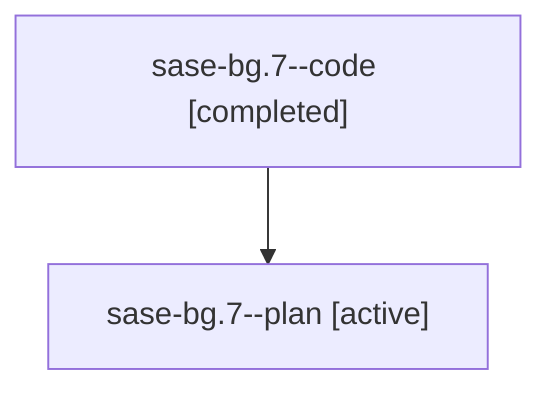

# Family: sase-bg.7

[Agent Hoods](../README.md) / [bbugyi200](../users/bbugyi200/README.md) / [athena](../users/bbugyi200/machines/athena/README.md) / [sase-bg](../users/bbugyi200/machines/athena/hoods/sase-bg/README.md) / sase-bg.7

Owner: `bbugyi200.athena` · Hood: `sase-bg` · Members: 2

## Lineage

The diagram is an optional enhancement; the ordered table below contains the same lineage in accessible text.

| Role | Agent | State | Model / provider | Timing | Commits | Prompt | Chat |
|---|---|---|---|---|---:|---|---|
| code | sase-bg.7--code | completed | gpt-5.6-sol / codex | 2026-07-31T00:08:41.092351+00:00 | 0 | — | [Chat](../agents/bbugyi200.athena.sase-bg.7--code/chat.md) |
| plan | sase-bg.7--plan | active | gpt-5.6-sol / codex | 2026-07-31T00:02:37.976616+00:00 | 0 | [Prompt](../agents/bbugyi200.athena.sase-bg.7--plan/prompt.md) | [Chat](../agents/bbugyi200.athena.sase-bg.7--plan/chat.md) |

## Commits

| Role | Repo | Commit | Subject | Committed |
|---|---|---|---|---|
| — | sase | [`879af9b`](https://github.com/sase-org/sase/commit/879af9b0831fa59a0bccaf580d11f6afd26ffb2c) | feat(bead): launch standalone task workers | 2026-07-30 20:45:26 EDT |

## Neighbors

| Agent | Relation | State |
|---|---|---|
| [sase-bg.1](../agents/bbugyi200.athena.sase-bg.1/README.md) | sase-bg hood | active |
| [sase-bg.10](../agents/bbugyi200.athena.sase-bg.10/README.md) | sase-bg hood | active |
| [sase-bg.2](../agents/bbugyi200.athena.sase-bg.2/README.md) | sase-bg hood | active |
| [sase-bg.3](../agents/bbugyi200.athena.sase-bg.3/README.md) | sase-bg hood | active |
| [sase-bg.4](bbugyi200.athena.sase-bg.4.md) (family · 2) | sase-bg hood | active 1, completed 1 |
| [sase-bg.5](../agents/bbugyi200.athena.sase-bg.5/README.md) | sase-bg hood | active |
| [sase-bg.6](../agents/bbugyi200.athena.sase-bg.6/README.md) | sase-bg hood | active |
| [sase-bg.8](bbugyi200.athena.sase-bg.8.md) (family · 2) | sase-bg hood | active 1, completed 1 |
| [sase-bg.9](../agents/bbugyi200.athena.sase-bg.9/README.md) | sase-bg hood | active |
| [sase-bg.land](../agents/bbugyi200.athena.sase-bg.land/README.md) | sase-bg hood | active |
