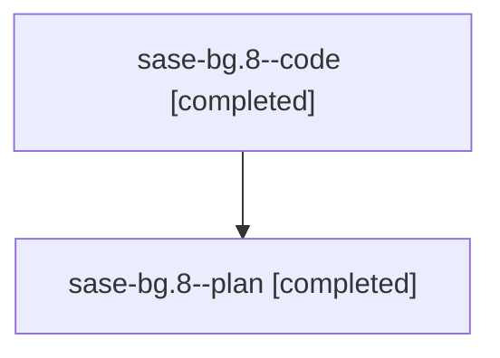

# Family: sase-bg.8

[Agent Hoods](../README.md) / [bbugyi200](../users/bbugyi200/README.md) / [athena](../users/bbugyi200/machines/athena/README.md) / [sase-bg](../users/bbugyi200/machines/athena/hoods/sase-bg/README.md) / sase-bg.8

Owner: `bbugyi200.athena` · Hood: `sase-bg` · Members: 2

## Lineage

The diagram is an optional enhancement; the ordered table below contains the same lineage in accessible text.

| Role | Agent | State | Model / provider | Timing | Commits | Prompt | Chat |
|---|---|---|---|---|---:|---|---|
| code | sase-bg.8--code | completed | gpt-5.6-sol / codex | 2026-07-31T01:09:06.061236+00:00 | [1](../agents/bbugyi200.athena.sase-bg.8--code/README.md#commits) | — | [Chat](../agents/bbugyi200.athena.sase-bg.8--code/chat.md) |
| plan | sase-bg.8--plan | completed | gpt-5.6-sol / codex | 2026-07-31T01:02:55.149546+00:00 | 0 | [Prompt](../agents/bbugyi200.athena.sase-bg.8--plan/prompt.md) | [Chat](../agents/bbugyi200.athena.sase-bg.8--plan/chat.md) |

## Commits

| Role | Repo | Commit | Subject | Committed (UTC) |
|---|---|---|---|---|
| code | sase | [`010fe0f`](https://github.com/sase-org/sase/commit/010fe0fc067fd818302a8967197297ef5d7c1b34) | feat(gates): add TaskTriage decision workflow | 2026-07-31 01:41:42 |

## Neighbors

| Agent | Relation | State |
|---|---|---|
| [sase-bg.1](../agents/bbugyi200.athena.sase-bg.1/README.md) | sase-bg hood | completed |
| [sase-bg.10](../agents/bbugyi200.athena.sase-bg.10/README.md) | sase-bg hood | active |
| [sase-bg.2](../agents/bbugyi200.athena.sase-bg.2/README.md) | sase-bg hood | completed |
| [sase-bg.3](../agents/bbugyi200.athena.sase-bg.3/README.md) | sase-bg hood | completed |
| [sase-bg.4](bbugyi200.athena.sase-bg.4.md) (family · 2) | sase-bg hood | completed 2 |
| [sase-bg.5](../agents/bbugyi200.athena.sase-bg.5/README.md) | sase-bg hood | completed |
| [sase-bg.6](../agents/bbugyi200.athena.sase-bg.6/README.md) | sase-bg hood | completed |
| [sase-bg.7](bbugyi200.athena.sase-bg.7.md) (family · 2) | sase-bg hood | completed 2 |
| [sase-bg.9](../agents/bbugyi200.athena.sase-bg.9/README.md) | sase-bg hood | completed |
| [sase-bg.land](../agents/bbugyi200.athena.sase-bg.land/README.md) | sase-bg hood | waiting |
