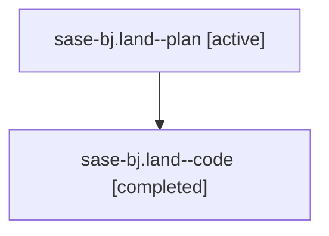

# Family: sase-bj.land

[Agent Hoods](../README.md) / [bbugyi200](../users/bbugyi200/README.md) / [athena](../users/bbugyi200/machines/athena/README.md) / [sase-bj](../users/bbugyi200/machines/athena/hoods/sase-bj/README.md) / sase-bj.land

Owner: `bbugyi200.athena` · Hood: `sase-bj` · Members: 2

## Lineage

The diagram is an optional enhancement; the ordered table below contains the same lineage in accessible text.

| Role | Agent | State | Model / provider | Timing | Commits | Prompt | Chat |
|---|---|---|---|---|---:|---|---|
| plan | sase-bj.land--plan | active | gpt-5.6-sol / codex | 2026-07-31T13:26:46.210790+00:00 | 0 | [Prompt](../agents/bbugyi200.athena.sase-bj.land--plan/prompt.md) | [Chat](../agents/bbugyi200.athena.sase-bj.land--plan/chat.md) |
| code | sase-bj.land--code | completed | gpt-5.3-codex-spark / codex | 2026-07-31T13:44:03.021863+00:00 | [1](../agents/bbugyi200.athena.sase-bj.land--code/README.md#commits) | — | [Chat](../agents/bbugyi200.athena.sase-bj.land--code/chat.md) |

## Commits

| Role | Repo | Commit | Subject | Committed |
|---|---|---|---|---|
| code | sase | [`9a6b203`](https://github.com/sase-org/sase/commit/9a6b20390e44b2b2dec6c546d2bf241b174021f4) | fix(commit): apply conventional subject gate updates | 2026-07-31 10:19:48 EDT |

## Neighbors

| Agent | Relation | State |
|---|---|---|
| [sase-bj.1](../agents/bbugyi200.athena.sase-bj.1/README.md) | sase-bj hood | active |
| [sase-bj.2](../agents/bbugyi200.athena.sase-bj.2/README.md) | sase-bj hood | active |
| [sase-bj.3](../agents/bbugyi200.athena.sase-bj.3/README.md) | sase-bj hood | active |
| [sase-bj.4](../agents/bbugyi200.athena.sase-bj.4/README.md) | sase-bj hood | active |
