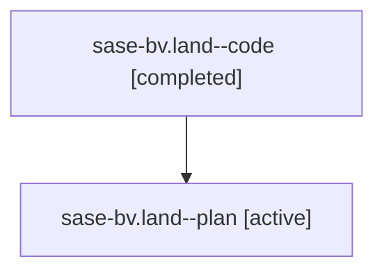

# Family: sase-bv.land

[Agent Hoods](../README.md) / [bbugyi200](../users/bbugyi200/README.md) / [athena](../users/bbugyi200/machines/athena/README.md) / [sase-bv](../users/bbugyi200/machines/athena/hoods/sase-bv/README.md) / sase-bv.land

Owner: `bbugyi200.athena` · Hood: `sase-bv` · Members: 2 · Bead: [sase-bv](https://github.com/sase-org/sase--beads/blob/main/pages/sase-bv/README.md)

## Lineage

The diagram is an optional enhancement; the ordered table below contains the same lineage in accessible text.

| Role | Agent | State | Model / provider | Timing | Commits | Prompt | Chat |
|---|---|---|---|---|---:|---|---|
| code | sase-bv.land--code | completed | sonnet / claude | 2026-07-31T15:08:24.731184+00:00 | [2](../agents/bbugyi200.athena.sase-bv.land--code/README.md#commits) | — | [Chat](../agents/bbugyi200.athena.sase-bv.land--code/chat.md) |
| plan | sase-bv.land--plan | active | opus / claude | 2026-07-31T14:52:48.374208+00:00 | 0 | [Prompt](../agents/bbugyi200.athena.sase-bv.land--plan/prompt.md) | [Chat](../agents/bbugyi200.athena.sase-bv.land--plan/chat.md) |

## Commits

| Role | Repo | Commit | Subject | Committed |
|---|---|---|---|---|
| code | sase | [`4fd54a9`](https://github.com/sase-org/sase/commit/4fd54a96707a0931b3c86a8c3551a2e0fbed0ea5) | fix(bead): route sase bead create through the attributing handler | 2026-07-31 15:15:17 UTC |
| code | sase | [`3a98c68`](https://github.com/sase-org/sase/commit/3a98c68df821b90d4445fbb5bff8c132fb42757c) | refactor(bead): remove superseded SASE\_AGENT guard from attribution | 2026-07-31 15:18:44 UTC |

## Neighbors

| Agent | Relation | State |
|---|---|---|
| [sase-bv.1](../agents/bbugyi200.athena.sase-bv.1/README.md) | sase-bv hood | active |
| [sase-bv.2](../agents/bbugyi200.athena.sase-bv.2/README.md) | sase-bv hood | active |
| [sase-bv.3](../agents/bbugyi200.athena.sase-bv.3/README.md) | sase-bv hood | active |
| [sase-bv.4](../agents/bbugyi200.athena.sase-bv.4/README.md) | sase-bv hood | active |
| [sase-bv.5](../agents/bbugyi200.athena.sase-bv.5/README.md) | sase-bv hood | active |
