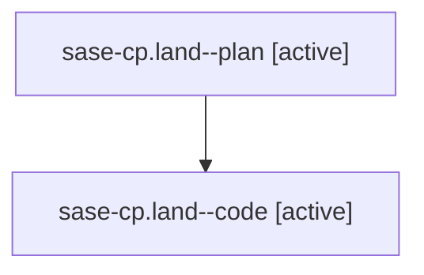

# Family: sase-cp.land

[Agent Hoods](../README.md) / [bbugyi200](../users/bbugyi200/README.md) / [athena](../users/bbugyi200/machines/athena/README.md) / [sase-cp](../users/bbugyi200/machines/athena/hoods/sase-cp/README.md) / sase-cp.land

Owner: `bbugyi200.athena` · Hood: `sase-cp` · Members: 2

## Lineage

The diagram is an optional enhancement; the ordered table below contains the same lineage in accessible text.

| Role | Agent | State | Model / provider | Timing | Commits | Prompt | Chat |
|---|---|---|---|---|---:|---|---|
| plan | sase-cp.land--plan | active | gpt-5.6-sol / codex | 2026-07-31T19:49:50.428351+00:00 | 0 | [Prompt](../agents/bbugyi200.athena.sase-cp.land--plan/prompt.md) | [Chat](../agents/bbugyi200.athena.sase-cp.land--plan/chat.md) |
| code | sase-cp.land--code | active | gpt-5.5 / codex | 2026-07-31T19:54:39.631993+00:00 | [1](../agents/bbugyi200.athena.sase-cp.land--code/README.md#commits) | — | — |

## Commits

| Role | Repo | Commit | Subject | Committed (UTC) |
|---|---|---|---|---|
| code | sase | [`33c6311`](https://github.com/sase-org/sase/commit/33c63112c911958e5a3c6111eb4f01caeb945794) | docs(memory): document bulk bead update semantics | 2026-07-31 20:25:18 |

## Neighbors

| Agent | Relation | State |
|---|---|---|
| [sase-cp.land.w0](../agents/bbugyi200.athena.sase-cp.land.w0/README.md) | descendant | dismissed |
| [sase-cp.1](../agents/bbugyi200.athena.sase-cp.1/README.md) | sase-cp hood | completed |
| [sase-cp.2](../agents/bbugyi200.athena.sase-cp.2/README.md) | sase-cp hood | completed |
| [sase-cp.3](../agents/bbugyi200.athena.sase-cp.3/README.md) | sase-cp hood | completed |
