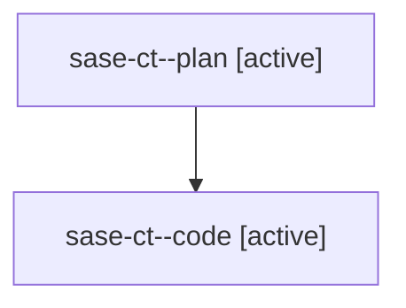

# Family: sase-ct

[Agent Hoods](../README.md) / [bbugyi200](../users/bbugyi200/README.md) / [athena](../users/bbugyi200/machines/athena/README.md) / [sase-ct](../users/bbugyi200/machines/athena/hoods/sase-ct/README.md) / sase-ct

Owner: `bbugyi200.athena` · Hood: `sase-ct` · Members: 2 · Bead: [sase-ct](https://github.com/sase-org/sase--beads/blob/main/pages/sase-ct/README.md)

## Lineage

The diagram is an optional enhancement; the ordered table below contains the same lineage in accessible text.

| Role | Agent | State | Model / provider | Timing | Commits | Prompt | Chat |
|---|---|---|---|---|---:|---|---|
| plan | sase-ct--plan | active | gpt-5.6-sol / codex | 2026-08-10T13:54:27.686310+00:00 | 0 | [Prompt](../agents/bbugyi200.athena.sase-ct--plan/prompt.md) | [Chat](../agents/bbugyi200.athena.sase-ct--plan/chat.md) |
| code | sase-ct--code | active | gpt-5.5 / codex | 2026-08-10T14:00:10.081587+00:00 | 0 | — | — |
