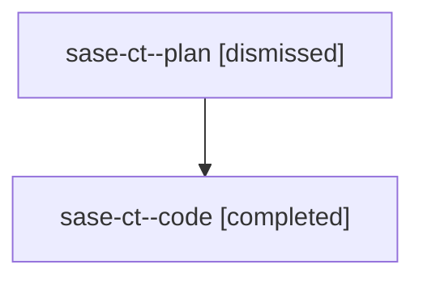

# Family: sase-ct

[Agent Hoods](../README.md) / [bbugyi200](../users/bbugyi200/README.md) / [athena](../users/bbugyi200/machines/athena/README.md) / [sase-ct](../users/bbugyi200/machines/athena/hoods/sase-ct/README.md) / sase-ct

Owner: `bbugyi200.athena` · Hood: `sase-ct` · Members: 2 · Bead: [sase-ct](https://github.com/sase-org/sase--beads/blob/main/pages/sase-ct/README.md)

## Lineage

The diagram is an optional enhancement; the ordered table below contains the same lineage in accessible text.

| Role | Agent | State | Model / provider | Timing | Commits | Prompt | Chat |
|---|---|---|---|---|---:|---|---|
| plan | sase-ct--plan | dismissed | gpt-5.6-sol / codex | 2026-08-10T09:54:27.686310 → 2026-08-10T10:20:59.561384 | 0 | — | [Chat](../agents/bbugyi200.athena.sase-ct--plan/chat.md) |
| code | sase-ct--code | completed | gpt-5.5 / codex | 2026-08-10T14:00:10.081587+00:00 | [1](../agents/bbugyi200.athena.sase-ct--code/README.md#commits) | — | [Chat](../agents/bbugyi200.athena.sase-ct--code/chat.md) |

## Commits

| Role | Repo | Commit | Subject | Committed |
|---|---|---|---|---|
| — | sase | [`bde727e`](https://github.com/sase-org/sase/commit/bde727ecc0dbe67a734584e2c1abf3dbe49e8730) | fix(ace-tui): stop bulk-kill-and-edit test racing relaunch prompt resolution | 2026-08-06 19:57:13 UTC |
| — | sase | [`3f69267`](https://github.com/sase-org/sase/commit/3f69267d516c5131ecca44b22399e67838b508c1) | fix(test-selection): stop the codeblock cursor test racing the blink timer | 2026-08-06 20:52:52 UTC |
| — | sase | [`156cac8`](https://github.com/sase-org/sase/commit/156cac833248c0dfac7d24df371e1e052754474e) | fix(tests): loosen exact hitch/stall counts in watchdog independence test | 2026-08-07 16:48:55 UTC |
| — | sase | [`b473a10`](https://github.com/sase-org/sase/commit/b473a10d098935135820fe86d61a1195dd1282c5) | fix(tests): wait for balanced hitch/recovery pairs in watchdog compact-loop test | 2026-08-07 18:24:22 UTC |
| code | sase | [`771f7d9`](https://github.com/sase-org/sase/commit/771f7d935a56623b583b9cac3acc5275c6140f97) | test: wait for prompt editor in relaunch tests | 2026-08-10 14:18:02 UTC |
