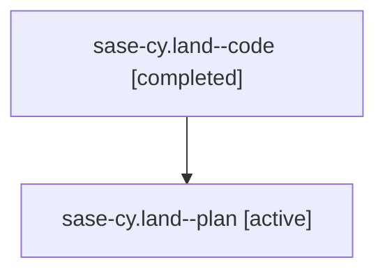

# Family: sase-cy.land

[Agent Hoods](../README.md) / [bbugyi200](../users/bbugyi200/README.md) / [athena](../users/bbugyi200/machines/athena/README.md) / [sase-cy](../users/bbugyi200/machines/athena/hoods/sase-cy/README.md) / sase-cy.land

Owner: `bbugyi200.athena` · Hood: `sase-cy` · Members: 2 · Bead: [sase-cy](https://github.com/sase-org/sase--beads/blob/main/pages/sase-cy/README.md)

## Lineage

The diagram is an optional enhancement; the ordered table below contains the same lineage in accessible text.

| Role | Agent | State | Model / provider | Timing | Commits | Prompt | Chat |
|---|---|---|---|---|---:|---|---|
| code | sase-cy.land--code | completed | gpt-5.5 / codex | 2026-08-01T13:07:10.070628+00:00 | [1](../agents/bbugyi200.athena.sase-cy.land--code/README.md#commits) | — | [Chat](../agents/bbugyi200.athena.sase-cy.land--code/chat.md) |
| plan | sase-cy.land--plan | active | gpt-5.6-sol / codex | 2026-08-01T12:58:21.960613+00:00 | 0 | [Prompt](../agents/bbugyi200.athena.sase-cy.land--plan/prompt.md) | [Chat](../agents/bbugyi200.athena.sase-cy.land--plan/chat.md) |

## Commits

| Role | Repo | Commit | Subject | Committed |
|---|---|---|---|---|
| code | sase | [`9cf08e7`](https://github.com/sase-org/sase/commit/9cf08e739663dcc62d91e5794bcaebfb6fe7d274) | build(deps): require core 0.17.5 for snoozing | 2026-08-01 13:54:28 UTC |

## Neighbors

| Agent | Relation | State |
|---|---|---|
| [sase-cy.1](../agents/bbugyi200.athena.sase-cy.1/README.md) | sase-cy hood | active |
| [sase-cy.2](../agents/bbugyi200.athena.sase-cy.2/README.md) | sase-cy hood | active |
| [sase-cy.3](../agents/bbugyi200.athena.sase-cy.3/README.md) | sase-cy hood | active |
| [sase-cy.4](../agents/bbugyi200.athena.sase-cy.4/README.md) | sase-cy hood | active |
