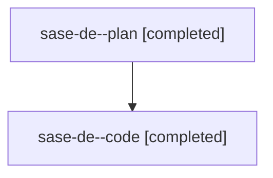

# Family: sase-de

[Agent Hoods](../README.md) / [bbugyi200](../users/bbugyi200/README.md) / [athena](../users/bbugyi200/machines/athena/README.md) / [sase-de](../users/bbugyi200/machines/athena/hoods/sase-de/README.md) / sase-de

Owner: `bbugyi200.athena` · Hood: `sase-de` · Members: 2

## Lineage

The diagram is an optional enhancement; the ordered table below contains the same lineage in accessible text.

| Role | Agent | State | Model / provider | Timing | Commits | Prompt | Chat |
|---|---|---|---|---|---:|---|---|
| plan | sase-de--plan | completed | gpt-5.6-sol / codex | 2026-08-01T14:17:51.474733+00:00 | 0 | [Prompt](../agents/bbugyi200.athena.sase-de--plan/prompt.md) | [Chat](../agents/bbugyi200.athena.sase-de--plan/chat.md) |
| code | sase-de--code | completed | gpt-5.5 / codex | 2026-08-01T14:25:06.455484+00:00 | [1](../agents/bbugyi200.athena.sase-de--code/README.md#commits) | — | [Chat](../agents/bbugyi200.athena.sase-de--code/chat.md) |

## Commits

| Role | Repo | Commit | Subject | Committed |
|---|---|---|---|---|
| code | sase | [`93dfb63`](https://github.com/sase-org/sase/commit/93dfb63587ece702ffde02b752cfd293da7eb2d8) | fix: update vendored pyscripts validator | 2026-08-01 10:55:59 EDT |
