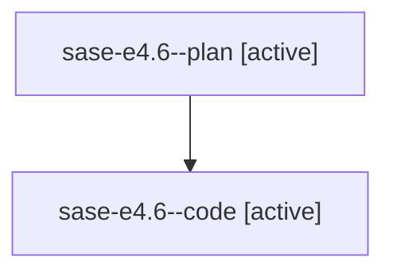

# Family: sase-e4.6

[Agent Hoods](../README.md) / [bbugyi200](../users/bbugyi200/README.md) / [athena](../users/bbugyi200/machines/athena/README.md) / [sase-e4](../users/bbugyi200/machines/athena/hoods/sase-e4/README.md) / sase-e4.6

Owner: `bbugyi200.athena` · Hood: `sase-e4` · Members: 2

## Lineage

The diagram is an optional enhancement; the ordered table below contains the same lineage in accessible text.

| Role | Agent | State | Model / provider | Timing | Commits | Prompt | Chat |
|---|---|---|---|---|---:|---|---|
| plan | sase-e4.6--plan | active | gpt-5.6-sol / codex | 2026-08-02T13:20:17.543246+00:00 | 0 | [Prompt](../agents/bbugyi200.athena.sase-e4.6--plan/prompt.md) | [Chat](../agents/bbugyi200.athena.sase-e4.6--plan/chat.md) |
| code | sase-e4.6--code | active | gpt-5.5 / codex | 2026-08-02T13:31:34.101420+00:00 | 0 | — | — |

## Neighbors

| Agent | Relation | State |
|---|---|---|
| [sase-e4.1](../agents/bbugyi200.athena.sase-e4.1/README.md) | sase-e4 hood | active |
| [sase-e4.2](../agents/bbugyi200.athena.sase-e4.2/README.md) | sase-e4 hood | waiting |
| [sase-e4.3](../agents/bbugyi200.athena.sase-e4.3/README.md) | sase-e4 hood | waiting |
| [sase-e4.4](../agents/bbugyi200.athena.sase-e4.4/README.md) | sase-e4 hood | waiting |
| [sase-e4.5](../agents/bbugyi200.athena.sase-e4.5/README.md) | sase-e4 hood | active |
| [sase-e4.land](../agents/bbugyi200.athena.sase-e4.land/README.md) | sase-e4 hood | waiting |
