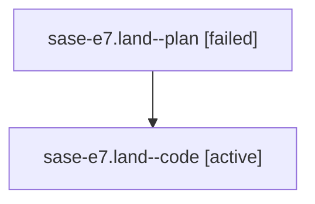

# Family: sase-e7.land

[Agent Hoods](../README.md) / [bbugyi200](../users/bbugyi200/README.md) / [athena](../users/bbugyi200/machines/athena/README.md) / [sase-e7](../users/bbugyi200/machines/athena/hoods/sase-e7/README.md) / sase-e7.land

Owner: `bbugyi200.athena` · Hood: `sase-e7` · Members: 2

## Lineage

The diagram is an optional enhancement; the ordered table below contains the same lineage in accessible text.

| Role | Agent | State | Model / provider | Timing | Commits | Prompt | Chat |
|---|---|---|---|---|---:|---|---|
| plan | sase-e7.land--plan | failed | opus / claude | 2026-08-02T16:01:30.298209+00:00 | 0 | [Prompt](../agents/bbugyi200.athena.sase-e7.land--plan/prompt.md) | [Chat](../agents/bbugyi200.athena.sase-e7.land--plan/chat.md) |
| code | sase-e7.land--code | active | sonnet / claude | 2026-08-02T16:17:54.764707+00:00 | 0 | — | — |

## Neighbors

| Agent | Relation | State |
|---|---|---|
| [sase-e7.1](../agents/bbugyi200.athena.sase-e7.1/README.md) | sase-e7 hood | completed |
| [sase-e7.2](../agents/bbugyi200.athena.sase-e7.2/README.md) | sase-e7 hood | completed |
| [sase-e7.3](../agents/bbugyi200.athena.sase-e7.3/README.md) | sase-e7 hood | completed |
| [sase-e7.4](../agents/bbugyi200.athena.sase-e7.4/README.md) | sase-e7 hood | completed |
| [sase-e7.5](../agents/bbugyi200.athena.sase-e7.5/README.md) | sase-e7 hood | completed |
