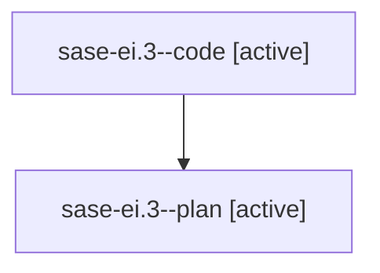

# Family: sase-ei.3

[Agent Hoods](../README.md) / [bbugyi200](../users/bbugyi200/README.md) / [athena](../users/bbugyi200/machines/athena/README.md) / [sase-ei](../users/bbugyi200/machines/athena/hoods/sase-ei/README.md) / sase-ei.3

Owner: `bbugyi200.athena` · Hood: `sase-ei` · Members: 2

## Lineage

The diagram is an optional enhancement; the ordered table below contains the same lineage in accessible text.

| Role | Agent | State | Model / provider | Timing | Commits | Prompt | Chat |
|---|---|---|---|---|---:|---|---|
| code | sase-ei.3--code | active | gpt-5.5 / codex | 2026-08-03T12:06:27.592602+00:00 | 0 | — | — |
| plan | sase-ei.3--plan | active | gpt-5.6-sol / codex | 2026-08-03T12:01:34.193983+00:00 | 0 | [Prompt](../agents/bbugyi200.athena.sase-ei.3--plan/prompt.md) | [Chat](../agents/bbugyi200.athena.sase-ei.3--plan/chat.md) |

## Neighbors

| Agent | Relation | State |
|---|---|---|
| [sase-ei.1](bbugyi200.athena.sase-ei.1.md) (family · 2) | sase-ei hood | completed 2 |
| [sase-ei.2](../agents/bbugyi200.athena.sase-ei.2/README.md) | sase-ei hood | active |
| [sase-ei.4](../agents/bbugyi200.athena.sase-ei.4/README.md) | sase-ei hood | waiting |
| [sase-ei.5](../agents/bbugyi200.athena.sase-ei.5/README.md) | sase-ei hood | waiting |
| [sase-ei.land](../agents/bbugyi200.athena.sase-ei.land/README.md) | sase-ei hood | waiting |
