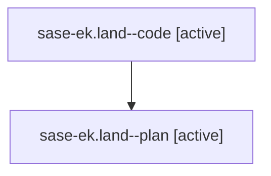

# Family: sase-ek.land

[Agent Hoods](../README.md) / [bbugyi200](../users/bbugyi200/README.md) / [athena](../users/bbugyi200/machines/athena/README.md) / [sase-ek](../users/bbugyi200/machines/athena/hoods/sase-ek/README.md) / sase-ek.land

Owner: `bbugyi200.athena` · Hood: `sase-ek` · Members: 2

## Lineage

The diagram is an optional enhancement; the ordered table below contains the same lineage in accessible text.

| Role | Agent | State | Model / provider | Timing | Commits | Prompt | Chat |
|---|---|---|---|---|---:|---|---|
| code | sase-ek.land--code | active | gpt-5.5 / codex | 2026-08-03T12:33:21.869988+00:00 | 0 | — | — |
| plan | sase-ek.land--plan | active | gpt-5.6-sol / codex | 2026-08-03T12:22:51.407712+00:00 | 0 | [Prompt](../agents/bbugyi200.athena.sase-ek.land--plan/prompt.md) | [Chat](../agents/bbugyi200.athena.sase-ek.land--plan/chat.md) |

## Neighbors

| Agent | Relation | State |
|---|---|---|
| [sase-ek.1](../agents/bbugyi200.athena.sase-ek.1/README.md) | sase-ek hood | completed |
| [sase-ek.2](../agents/bbugyi200.athena.sase-ek.2/README.md) | sase-ek hood | completed |
| [sase-ek.3](../agents/bbugyi200.athena.sase-ek.3/README.md) | sase-ek hood | completed |
