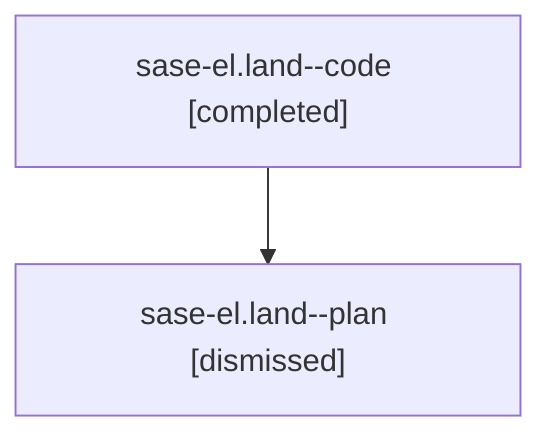

# Family: sase-el.land

[Agent Hoods](../README.md) / [bbugyi200](../users/bbugyi200/README.md) / [athena](../users/bbugyi200/machines/athena/README.md) / [sase-el](../users/bbugyi200/machines/athena/hoods/sase-el/README.md) / sase-el.land

Owner: `bbugyi200.athena` · Hood: `sase-el` · Members: 2

## Lineage

The diagram is an optional enhancement; the ordered table below contains the same lineage in accessible text.

| Role | Agent | State | Model / provider | Timing | Commits | Prompt | Chat |
|---|---|---|---|---|---:|---|---|
| code | sase-el.land--code | completed | gpt-5.5 / codex | 2026-08-03T14:43:41.873832+00:00 | [1](../agents/bbugyi200.athena.sase-el.land--code/README.md#commits) | — | [Chat](../agents/bbugyi200.athena.sase-el.land--code/chat.md) |
| plan | sase-el.land--plan | dismissed | gpt-5.6-sol / codex | 2026-08-03T10:32:22.326823 → 2026-08-03T11:09:20.274906 | 0 | — | [Chat](../agents/bbugyi200.athena.sase-el.land--plan/chat.md) |

## Commits

| Role | Repo | Commit | Subject | Committed |
|---|---|---|---|---|
| code | sase | [`cd9815f`](https://github.com/sase-org/sase/commit/cd9815ff60ca70840e1530c82394ebf8c2d4e175) | test: harden agent CLI history timezone checks | 2026-08-03 11:08:15 EDT |

## Neighbors

| Agent | Relation | State |
|---|---|---|
| [sase-el.1](../agents/bbugyi200.athena.sase-el.1/README.md) | sase-el hood | dismissed |
| [sase-el.2](../agents/bbugyi200.athena.sase-el.2/README.md) | sase-el hood | dismissed |
| [sase-el.3](../agents/bbugyi200.athena.sase-el.3/README.md) | sase-el hood | dismissed |
| [sase-el.4](../agents/bbugyi200.athena.sase-el.4/README.md) | sase-el hood | dismissed |
