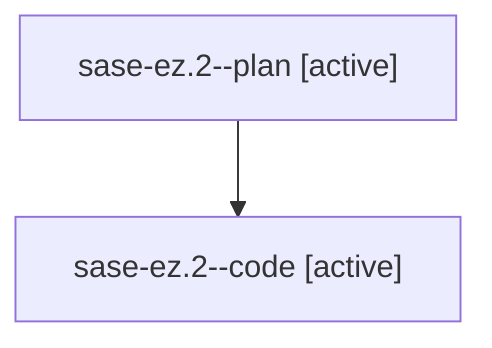

# Family: sase-ez.2

[Agent Hoods](../README.md) / [bbugyi200](../users/bbugyi200/README.md) / [athena](../users/bbugyi200/machines/athena/README.md) / [sase-ez](../users/bbugyi200/machines/athena/hoods/sase-ez/README.md) / sase-ez.2

Owner: `bbugyi200.athena` · Hood: `sase-ez` · Members: 2

## Lineage

The diagram is an optional enhancement; the ordered table below contains the same lineage in accessible text.

| Role | Agent | State | Model / provider | Timing | Commits | Prompt | Chat |
|---|---|---|---|---|---:|---|---|
| plan | sase-ez.2--plan | active | gpt-5.6-sol / codex | 2026-08-03T19:35:13.948527+00:00 | 0 | [Prompt](../agents/bbugyi200.athena.sase-ez.2--plan/prompt.md) | [Chat](../agents/bbugyi200.athena.sase-ez.2--plan/chat.md) |
| code | sase-ez.2--code | active | gpt-5.5 / codex | 2026-08-03T19:39:51.331011+00:00 | 0 | — | — |

## Neighbors

| Agent | Relation | State |
|---|---|---|
| [sase-ez.1](../agents/bbugyi200.athena.sase-ez.1/README.md) | sase-ez hood | completed |
| [sase-ez.3](../agents/bbugyi200.athena.sase-ez.3/README.md) | sase-ez hood | active |
| [sase-ez.4](../agents/bbugyi200.athena.sase-ez.4/README.md) | sase-ez hood | active |
| [sase-ez.5](../agents/bbugyi200.athena.sase-ez.5/README.md) | sase-ez hood | waiting |
| [sase-ez.land](../agents/bbugyi200.athena.sase-ez.land/README.md) | sase-ez hood | waiting |
