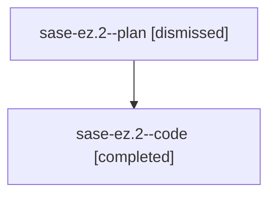

# Family: sase-ez.2

[Agent Hoods](../README.md) / [bbugyi200](../users/bbugyi200/README.md) / [athena](../users/bbugyi200/machines/athena/README.md) / [sase-ez](../users/bbugyi200/machines/athena/hoods/sase-ez/README.md) / sase-ez.2

Owner: `bbugyi200.athena` · Hood: `sase-ez` · Members: 2

## Lineage

The diagram is an optional enhancement; the ordered table below contains the same lineage in accessible text.

| Role | Agent | State | Model / provider | Timing | Commits | Prompt | Chat |
|---|---|---|---|---|---:|---|---|
| plan | sase-ez.2--plan | dismissed | gpt-5.6-sol / codex | 2026-08-03T15:35:13.948527 → 2026-08-03T16:27:51.478278 | 0 | — | [Chat](../agents/bbugyi200.athena.sase-ez.2--plan/chat.md) |
| code | sase-ez.2--code | completed | gpt-5.5 / codex | 2026-08-03T19:39:51.331011+00:00 | [1](../agents/bbugyi200.athena.sase-ez.2--code/README.md#commits) | — | [Chat](../agents/bbugyi200.athena.sase-ez.2--code/chat.md) |

## Commits

| Role | Repo | Commit | Subject | Committed |
|---|---|---|---|---|
| code | sase | [`a33aaa1`](https://github.com/sase-org/sase/commit/a33aaa1c22940db6db74d51049d4046f10ad4a9e) | test(beads): align dep rm missing-edge expectation | 2026-08-03 16:02:43 EDT |

## Neighbors

| Agent | Relation | State |
|---|---|---|
| [sase-ez.1](../agents/bbugyi200.athena.sase-ez.1/README.md) | sase-ez hood | dismissed |
| [sase-ez.3](../agents/bbugyi200.athena.sase-ez.3/README.md) | sase-ez hood | dismissed |
| [sase-ez.4](bbugyi200.athena.sase-ez.4.md) (family · 2) | sase-ez hood | completed 1, dismissed 1 |
| [sase-ez.5](../agents/bbugyi200.athena.sase-ez.5/README.md) | sase-ez hood | dismissed |
| [sase-ez.land](../agents/bbugyi200.athena.sase-ez.land/README.md) | sase-ez hood | dismissed |
