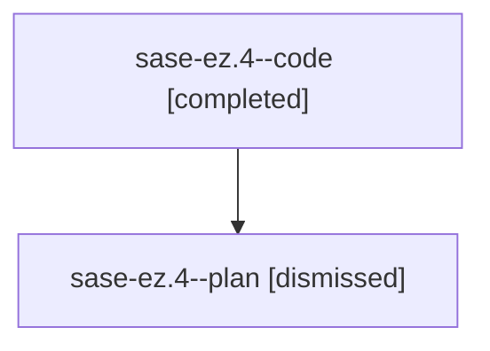

# Family: sase-ez.4

[Agent Hoods](../README.md) / [bbugyi200](../users/bbugyi200/README.md) / [athena](../users/bbugyi200/machines/athena/README.md) / [sase-ez](../users/bbugyi200/machines/athena/hoods/sase-ez/README.md) / sase-ez.4

Owner: `bbugyi200.athena` · Hood: `sase-ez` · Members: 2

## Lineage

The diagram is an optional enhancement; the ordered table below contains the same lineage in accessible text.

| Role | Agent | State | Model / provider | Timing | Commits | Prompt | Chat |
|---|---|---|---|---|---:|---|---|
| code | sase-ez.4--code | completed | gpt-5.5 / codex | 2026-08-03T19:45:35.011673+00:00 | 0 | — | [Chat](../agents/bbugyi200.athena.sase-ez.4--code/chat.md) |
| plan | sase-ez.4--plan | dismissed | gpt-5.6-sol / codex | 2026-08-03T15:35:07.831757 → 2026-08-03T16:43:41.423210 | 0 | — | [Chat](../agents/bbugyi200.athena.sase-ez.4--plan/chat.md) |

## Neighbors

| Agent | Relation | State |
|---|---|---|
| [sase-ez.1](../agents/bbugyi200.athena.sase-ez.1/README.md) | sase-ez hood | dismissed |
| [sase-ez.2](bbugyi200.athena.sase-ez.2.md) (family · 2) | sase-ez hood | completed 1, dismissed 1 |
| [sase-ez.3](../agents/bbugyi200.athena.sase-ez.3/README.md) | sase-ez hood | dismissed |
| [sase-ez.5](../agents/bbugyi200.athena.sase-ez.5/README.md) | sase-ez hood | dismissed |
| [sase-ez.land](../agents/bbugyi200.athena.sase-ez.land/README.md) | sase-ez hood | dismissed |
