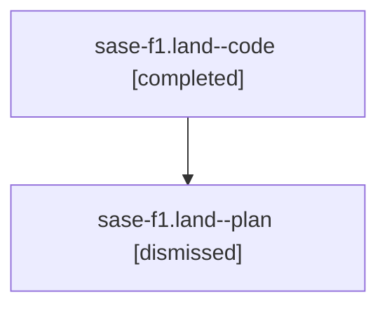

# Family: sase-f1.land

[Agent Hoods](../README.md) / [bbugyi200](../users/bbugyi200/README.md) / [athena](../users/bbugyi200/machines/athena/README.md) / [sase-f1](../users/bbugyi200/machines/athena/hoods/sase-f1/README.md) / sase-f1.land

Owner: `bbugyi200.athena` · Hood: `sase-f1` · Members: 2

## Lineage

The diagram is an optional enhancement; the ordered table below contains the same lineage in accessible text.

| Role | Agent | State | Model / provider | Timing | Commits | Prompt | Chat |
|---|---|---|---|---|---:|---|---|
| code | sase-f1.land--code | completed | gpt-5.5 / codex | 2026-08-03T20:49:15.855486+00:00 | 0 | — | [Chat](../agents/bbugyi200.athena.sase-f1.land--code/chat.md) |
| plan | sase-f1.land--plan | dismissed | gpt-5.6-sol / codex | 2026-08-03T16:43:03.733892 → 2026-08-03T17:45:04.512201 | 0 | — | [Chat](../agents/bbugyi200.athena.sase-f1.land--plan/chat.md) |

## Neighbors

| Agent | Relation | State |
|---|---|---|
| [sase-f1.1](../agents/bbugyi200.athena.sase-f1.1/README.md) | sase-f1 hood | dismissed |
| [sase-f1.2](../agents/bbugyi200.athena.sase-f1.2/README.md) | sase-f1 hood | dismissed |
| [sase-f1.3](../agents/bbugyi200.athena.sase-f1.3/README.md) | sase-f1 hood | dismissed |
| [sase-f1.4](../agents/bbugyi200.athena.sase-f1.4/README.md) | sase-f1 hood | dismissed |
