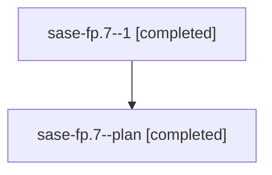

# Family: sase-fp.7

[Agent Hoods](../README.md) / [bbugyi200](../users/bbugyi200/README.md) / [athena](../users/bbugyi200/machines/athena/README.md) / [sase-fp](../users/bbugyi200/machines/athena/hoods/sase-fp/README.md) / sase-fp.7

Owner: `bbugyi200.athena` · Hood: `sase-fp` · Members: 2

## Lineage

The diagram is an optional enhancement; the ordered table below contains the same lineage in accessible text.

| Role | Agent | State | Model / provider | Timing | Commits | Prompt | Chat |
|---|---|---|---|---|---:|---|---|
| 1 | sase-fp.7--1 | completed | sonnet / claude | 2026-08-06T03:50:09.616728+00:00 | [1](../agents/bbugyi200.athena.sase-fp.7--1/README.md#commits) | — | [Chat](../agents/bbugyi200.athena.sase-fp.7--1/chat.md) |
| plan | sase-fp.7--plan | completed | sonnet / claude | 2026-08-06T03:47:47.953782+00:00 | 0 | [Prompt](../agents/bbugyi200.athena.sase-fp.7--plan/prompt.md) | [Chat](../agents/bbugyi200.athena.sase-fp.7--plan/chat.md) |

## Commits

| Role | Repo | Commit | Subject | Committed |
|---|---|---|---|---|
| 1 | sase | [`6f1a071`](https://github.com/sase-org/sase/commit/6f1a0717f1af3ee11f757a4820822427f5489670) | docs(memory): document two-speed verification contract, fix stale visual-snapshot claim | 2026-08-06 00:03:12 EDT |

## Neighbors

| Agent | Relation | State |
|---|---|---|
| [sase-fp.1](../agents/bbugyi200.athena.sase-fp.1/README.md) | sase-fp hood | completed |
| [sase-fp.2](../agents/bbugyi200.athena.sase-fp.2/README.md) | sase-fp hood | completed |
| [sase-fp.3](../agents/bbugyi200.athena.sase-fp.3/README.md) | sase-fp hood | completed |
| [sase-fp.4](../agents/bbugyi200.athena.sase-fp.4/README.md) | sase-fp hood | completed |
| [sase-fp.5](../agents/bbugyi200.athena.sase-fp.5/README.md) | sase-fp hood | completed |
| [sase-fp.6](../agents/bbugyi200.athena.sase-fp.6/README.md) | sase-fp hood | completed |
| [sase-fp.8.1](../agents/bbugyi200.athena.sase-fp.8.1/README.md) | sase-fp hood | active |
| [sase-fp.8.2](../agents/bbugyi200.athena.sase-fp.8.2/README.md) | sase-fp hood | active |
| [sase-fp.8.3](../agents/bbugyi200.athena.sase-fp.8.3/README.md) | sase-fp hood | waiting |
| [sase-fp.8.land](../agents/bbugyi200.athena.sase-fp.8.land/README.md) | sase-fp hood | waiting |
| [sase-fp.land](../agents/bbugyi200.athena.sase-fp.land/README.md) | sase-fp hood | failed |
