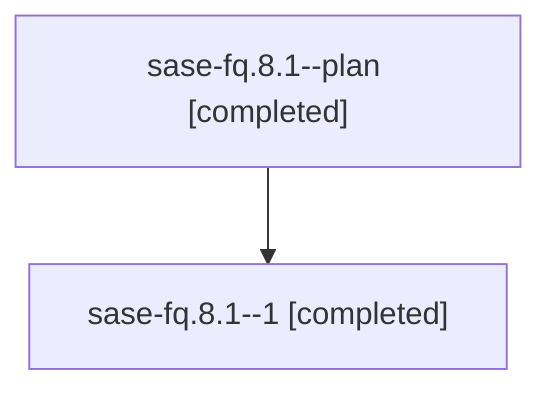

# Family: sase-fq.8.1

[Agent Hoods](../README.md) / [bbugyi200](../users/bbugyi200/README.md) / [athena](../users/bbugyi200/machines/athena/README.md) / [sase-fq](../users/bbugyi200/machines/athena/hoods/sase-fq/README.md) / sase-fq.8.1

Owner: `bbugyi200.athena` · Hood: `sase-fq` · Members: 2

## Lineage

The diagram is an optional enhancement; the ordered table below contains the same lineage in accessible text.

| Role | Agent | State | Model / provider | Timing | Commits | Prompt | Chat |
|---|---|---|---|---|---:|---|---|
| plan | sase-fq.8.1--plan | completed | opus / claude | 2026-08-06T11:06:05.406764+00:00 | 0 | [Prompt](../agents/bbugyi200.athena.sase-fq.8.1--plan/prompt.md) | [Chat](../agents/bbugyi200.athena.sase-fq.8.1--plan/chat.md) |
| 1 | sase-fq.8.1--1 | completed | opus / claude | 2026-08-06T11:30:30.324328+00:00 | 0 | — | [Chat](../agents/bbugyi200.athena.sase-fq.8.1--1/chat.md) |

## Neighbors

| Agent | Relation | State |
|---|---|---|
| [sase-fq.8.2](../agents/bbugyi200.athena.sase-fq.8.2/README.md) | sase-fq.8 hood | active |
| [sase-fq.8.3](../agents/bbugyi200.athena.sase-fq.8.3/README.md) | sase-fq.8 hood | waiting |
| [sase-fq.8.land](../agents/bbugyi200.athena.sase-fq.8.land/README.md) | sase-fq.8 hood | waiting |
| [sase-fq.1](../agents/bbugyi200.athena.sase-fq.1/README.md) | sase-fq hood | dismissed |
| [sase-fq.2](../agents/bbugyi200.athena.sase-fq.2/README.md) | sase-fq hood | dismissed |
| [sase-fq.3](../agents/bbugyi200.athena.sase-fq.3/README.md) | sase-fq hood | dismissed |
| [sase-fq.4](../agents/bbugyi200.athena.sase-fq.4/README.md) | sase-fq hood | dismissed |
| [sase-fq.5](../agents/bbugyi200.athena.sase-fq.5/README.md) | sase-fq hood | dismissed |
| [sase-fq.6](../agents/bbugyi200.athena.sase-fq.6/README.md) | sase-fq hood | dismissed |
| [sase-fq.7](../agents/bbugyi200.athena.sase-fq.7/README.md) | sase-fq hood | dismissed |
| [sase-fq.land](../agents/bbugyi200.athena.sase-fq.land/README.md) | sase-fq hood | dismissed |
