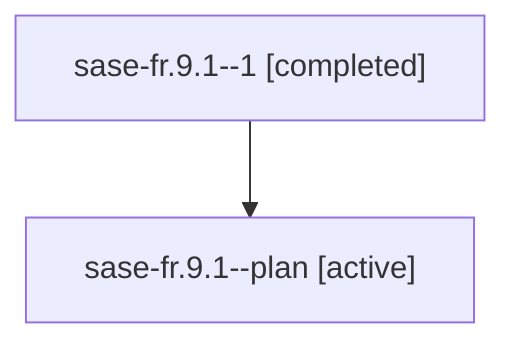

# Family: sase-fr.9.1

[Agent Hoods](../README.md) / [bbugyi200](../users/bbugyi200/README.md) / [athena](../users/bbugyi200/machines/athena/README.md) / [sase-fr](../users/bbugyi200/machines/athena/hoods/sase-fr/README.md) / sase-fr.9.1

Owner: `bbugyi200.athena` · Hood: `sase-fr` · Members: 2 · Bead: [sase-fr.9.1](https://github.com/sase-org/sase--beads/blob/main/pages/sase-fr/sase-fr.9.1.md)

## Lineage

The diagram is an optional enhancement; the ordered table below contains the same lineage in accessible text.

| Role | Agent | State | Model / provider | Timing | Commits | Prompt | Chat |
|---|---|---|---|---|---:|---|---|
| 1 | sase-fr.9.1--1 | completed | opus / claude | 2026-08-06T04:45:43.234008+00:00 | 0 | — | [Chat](../agents/bbugyi200.athena.sase-fr.9.1--1/chat.md) |
| plan | sase-fr.9.1--plan | active | opus / claude | 2026-08-06T04:20:31.733417+00:00 | 0 | [Prompt](../agents/bbugyi200.athena.sase-fr.9.1--plan/prompt.md) | [Chat](../agents/bbugyi200.athena.sase-fr.9.1--plan/chat.md) |

## Neighbors

| Agent | Relation | State |
|---|---|---|
| [sase-fr.9.2](bbugyi200.athena.sase-fr.9.2.md) (family · 2) | sase-fr.9 hood | active 1, completed 1 |
| [sase-fr.9.3](../agents/bbugyi200.athena.sase-fr.9.3/README.md) | sase-fr.9 hood | active |
| [sase-fr.9.land](../agents/bbugyi200.athena.sase-fr.9.land/README.md) | sase-fr.9 hood | active |
| [sase-fr.1](../agents/bbugyi200.athena.sase-fr.1/README.md) | sase-fr hood | active |
| [sase-fr.2](../agents/bbugyi200.athena.sase-fr.2/README.md) | sase-fr hood | active |
| [sase-fr.3](../agents/bbugyi200.athena.sase-fr.3/README.md) | sase-fr hood | active |
| [sase-fr.4](../agents/bbugyi200.athena.sase-fr.4/README.md) | sase-fr hood | active |
| [sase-fr.5](../agents/bbugyi200.athena.sase-fr.5/README.md) | sase-fr hood | active |
| [sase-fr.6](../agents/bbugyi200.athena.sase-fr.6/README.md) | sase-fr hood | active |
| [sase-fr.7](../agents/bbugyi200.athena.sase-fr.7/README.md) | sase-fr hood | active |
| [sase-fr.8](../agents/bbugyi200.athena.sase-fr.8/README.md) | sase-fr hood | active |
| [sase-fr.land](../agents/bbugyi200.athena.sase-fr.land/README.md) | sase-fr hood | active |
