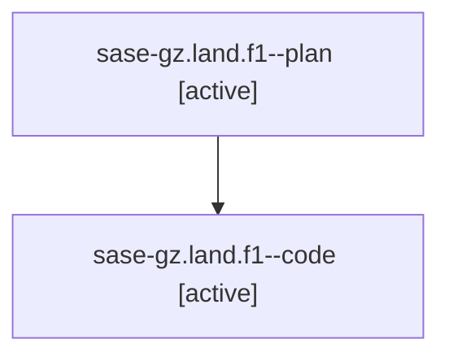

# Family: sase-gz.land.f1

[Agent Hoods](../README.md) / [bbugyi200](../users/bbugyi200/README.md) / [athena](../users/bbugyi200/machines/athena/README.md) / [sase-gz](../users/bbugyi200/machines/athena/hoods/sase-gz/README.md) / sase-gz.land.f1

Owner: `bbugyi200.athena` · Hood: `sase-gz` · Members: 2

## Lineage

The diagram is an optional enhancement; the ordered table below contains the same lineage in accessible text.

| Role | Agent | State | Model / provider | Timing | Commits | Prompt | Chat |
|---|---|---|---|---|---:|---|---|
| plan | sase-gz.land.f1--plan | active | opus / claude | 2026-08-07T17:28:20.189094+00:00 | 0 | [Prompt](../agents/bbugyi200.athena.sase-gz.land.f1--plan/prompt.md) | [Chat](../agents/bbugyi200.athena.sase-gz.land.f1--plan/chat.md) |
| code | sase-gz.land.f1--code | active | sonnet / claude | 2026-08-07T17:34:51.896577+00:00 | [1](../agents/bbugyi200.athena.sase-gz.land.f1--code/README.md#commits) | — | — |

## Commits

| Role | Repo | Commit | Subject | Committed |
|---|---|---|---|---|
| code | sase | [`4a03351`](https://github.com/sase-org/sase/commit/4a03351ecd4f8cbd041892cd4e437faa079338d4) | fix(ace): keep the notification modal's tag strip visible with a single tab | 2026-08-07 14:06:12 EDT |

## Neighbors

| Agent | Relation | State |
|---|---|---|
| [sase-gz.land](../agents/bbugyi200.athena.sase-gz.land/README.md) | ancestor | completed |
| [sase-gz.1](../agents/bbugyi200.athena.sase-gz.1/README.md) | sase-gz hood | completed |
| [sase-gz.2](../agents/bbugyi200.athena.sase-gz.2/README.md) | sase-gz hood | completed |
| [sase-gz.3](../agents/bbugyi200.athena.sase-gz.3/README.md) | sase-gz hood | completed |
| [sase-gz.4](../agents/bbugyi200.athena.sase-gz.4/README.md) | sase-gz hood | completed |
| [sase-gz.5](../agents/bbugyi200.athena.sase-gz.5/README.md) | sase-gz hood | completed |
| [sase-gz.6](../agents/bbugyi200.athena.sase-gz.6/README.md) | sase-gz hood | completed |
