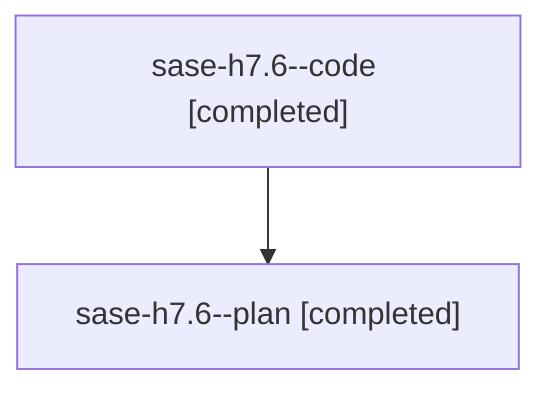

# Family: sase-h7.6

[Agent Hoods](../README.md) / [bbugyi200](../users/bbugyi200/README.md) / [athena](../users/bbugyi200/machines/athena/README.md) / [sase-h7](../users/bbugyi200/machines/athena/hoods/sase-h7/README.md) / sase-h7.6

Owner: `bbugyi200.athena` · Hood: `sase-h7` · Members: 2 · Bead: [sase-h7.6](https://github.com/sase-org/sase--beads/blob/main/pages/sase-h7/sase-h7.6.md)

## Lineage

The diagram is an optional enhancement; the ordered table below contains the same lineage in accessible text.

| Role | Agent | State | Model / provider | Timing | Commits | Prompt | Chat |
|---|---|---|---|---|---:|---|---|
| code | sase-h7.6--code | completed | sonnet / claude | 2026-08-08T00:10:51.331893+00:00 | [1](../agents/bbugyi200.athena.sase-h7.6--code/README.md#commits) | — | [Chat](../agents/bbugyi200.athena.sase-h7.6--code/chat.md) |
| plan | sase-h7.6--plan | completed | opus / claude | 2026-08-08T00:01:35.337479+00:00 | 0 | [Prompt](../agents/bbugyi200.athena.sase-h7.6--plan/prompt.md) | [Chat](../agents/bbugyi200.athena.sase-h7.6--plan/chat.md) |

## Commits

| Role | Repo | Commit | Subject | Committed |
|---|---|---|---|---|
| code | sase | [`e1da6d1`](https://github.com/sase-org/sase/commit/e1da6d1b76fd1ea28bc620ab20ad63085842e932) | feat(notification-gates): collect typed gate inputs in the ACE modals | 2026-08-07 21:37:07 EDT |

## Neighbors

| Agent | Relation | State |
|---|---|---|
| [sase-h7.1](../agents/bbugyi200.athena.sase-h7.1/README.md) | sase-h7 hood | dismissed |
| [sase-h7.10](../agents/bbugyi200.athena.sase-h7.10/README.md) | sase-h7 hood | completed |
| [sase-h7.11](../agents/bbugyi200.athena.sase-h7.11/README.md) | sase-h7 hood | completed |
| [sase-h7.12](../agents/bbugyi200.athena.sase-h7.12/README.md) | sase-h7 hood | completed |
| [sase-h7.13.1](../agents/bbugyi200.athena.sase-h7.13.1/README.md) | sase-h7 hood | completed |
| [sase-h7.13.2](../agents/bbugyi200.athena.sase-h7.13.2/README.md) | sase-h7 hood | completed |
| [sase-h7.13.3](../agents/bbugyi200.athena.sase-h7.13.3/README.md) | sase-h7 hood | completed |
| [sase-h7.13.4](../agents/bbugyi200.athena.sase-h7.13.4/README.md) | sase-h7 hood | active |
| [sase-h7.13.5](../agents/bbugyi200.athena.sase-h7.13.5/README.md) | sase-h7 hood | waiting |
| [sase-h7.13.land](../agents/bbugyi200.athena.sase-h7.13.land/README.md) | sase-h7 hood | waiting |
| [sase-h7.2](../agents/bbugyi200.athena.sase-h7.2/README.md) | sase-h7 hood | dismissed |
| [sase-h7.3](bbugyi200.athena.sase-h7.3.md) (family · 2) | sase-h7 hood | completed 1, dismissed 1 |
| [sase-h7.4](../agents/bbugyi200.athena.sase-h7.4/README.md) | sase-h7 hood | dismissed |
| [sase-h7.5](../agents/bbugyi200.athena.sase-h7.5/README.md) | sase-h7 hood | dismissed |
| [sase-h7.7](../agents/bbugyi200.athena.sase-h7.7/README.md) | sase-h7 hood | dismissed |
| [sase-h7.8](bbugyi200.athena.sase-h7.8.md) (family · 2) | sase-h7 hood | completed 2 |
| [sase-h7.9](../agents/bbugyi200.athena.sase-h7.9/README.md) | sase-h7 hood | dismissed |
| [sase-h7.land](../agents/bbugyi200.athena.sase-h7.land/README.md) | sase-h7 hood | failed |
