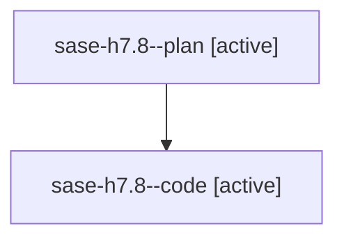

# Family: sase-h7.8

[Agent Hoods](../README.md) / [bbugyi200](../users/bbugyi200/README.md) / [athena](../users/bbugyi200/machines/athena/README.md) / [sase-h7](../users/bbugyi200/machines/athena/hoods/sase-h7/README.md) / sase-h7.8

Owner: `bbugyi200.athena` · Hood: `sase-h7` · Members: 2 · Bead: [sase-h7.8](https://github.com/sase-org/sase--beads/blob/main/pages/sase-h7/sase-h7.8.md)

## Lineage

The diagram is an optional enhancement; the ordered table below contains the same lineage in accessible text.

| Role | Agent | State | Model / provider | Timing | Commits | Prompt | Chat |
|---|---|---|---|---|---:|---|---|
| plan | sase-h7.8--plan | active | opus / claude | 2026-08-08T00:01:38.750672+00:00 | 0 | [Prompt](../agents/bbugyi200.athena.sase-h7.8--plan/prompt.md) | [Chat](../agents/bbugyi200.athena.sase-h7.8--plan/chat.md) |
| code | sase-h7.8--code | active | sonnet / claude | 2026-08-08T00:10:02.618974+00:00 | 0 | — | — |

## Commits

| Role | Repo | Commit | Subject | Committed |
|---|---|---|---|---|
| — | sase | [`7bbd82a`](https://github.com/sase-org/sase/commit/7bbd82a47ed7b3e2aec55ec0dfce76ed128f1cb5) | feat(mobile): accept per-option gate inputs on the mobile bridge | 2026-08-07 19:31:45 EDT |

## Neighbors

| Agent | Relation | State |
|---|---|---|
| [sase-h7.1](../agents/bbugyi200.athena.sase-h7.1/README.md) | sase-h7 hood | dismissed |
| [sase-h7.10](../agents/bbugyi200.athena.sase-h7.10/README.md) | sase-h7 hood | active |
| [sase-h7.11](../agents/bbugyi200.athena.sase-h7.11/README.md) | sase-h7 hood | waiting |
| [sase-h7.12](../agents/bbugyi200.athena.sase-h7.12/README.md) | sase-h7 hood | waiting |
| [sase-h7.2](../agents/bbugyi200.athena.sase-h7.2/README.md) | sase-h7 hood | dismissed |
| [sase-h7.3](bbugyi200.athena.sase-h7.3.md) (family · 2) | sase-h7 hood | completed 1, dismissed 1 |
| [sase-h7.4](../agents/bbugyi200.athena.sase-h7.4/README.md) | sase-h7 hood | dismissed |
| [sase-h7.5](../agents/bbugyi200.athena.sase-h7.5/README.md) | sase-h7 hood | dismissed |
| [sase-h7.6](bbugyi200.athena.sase-h7.6.md) (family · 2) | sase-h7 hood | active 2 |
| [sase-h7.7](../agents/bbugyi200.athena.sase-h7.7/README.md) | sase-h7 hood | dismissed |
| [sase-h7.9](../agents/bbugyi200.athena.sase-h7.9/README.md) | sase-h7 hood | dismissed |
| [sase-h7.land](../agents/bbugyi200.athena.sase-h7.land/README.md) | sase-h7 hood | waiting |
