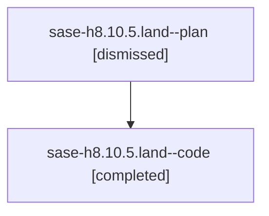

# Family: sase-h8.10.5.land

[Agent Hoods](../README.md) / [bbugyi200](../users/bbugyi200/README.md) / [athena](../users/bbugyi200/machines/athena/README.md) / [sase-h8](../users/bbugyi200/machines/athena/hoods/sase-h8/README.md) / sase-h8.10.5.land

Owner: `bbugyi200.athena` · Hood: `sase-h8` · Members: 2 · Bead: [sase-h8.10.5](https://github.com/sase-org/sase--beads/blob/main/pages/sase-h8/sase-h8.10.5.md)

## Lineage

The diagram is an optional enhancement; the ordered table below contains the same lineage in accessible text.

| Role | Agent | State | Model / provider | Timing | Commits | Prompt | Chat |
|---|---|---|---|---|---:|---|---|
| plan | sase-h8.10.5.land--plan | dismissed | gpt-5.6-sol / codex | 2026-08-08T17:30:05.738619 → 2026-08-08T20:41:40.277496 | 0 | — | [Chat](../agents/bbugyi200.athena.sase-h8.10.5.land--plan/chat.md) |
| code | sase-h8.10.5.land--code | completed | gpt-5.5 / codex | 2026-08-08T22:09:13.208354+00:00 | [1](../agents/bbugyi200.athena.sase-h8.10.5.land--code/README.md#commits) | — | [Chat](../agents/bbugyi200.athena.sase-h8.10.5.land--code/chat.md) |

## Commits

| Role | Repo | Commit | Subject | Committed |
|---|---|---|---|---|
| code | sase | [`aeab1cb`](https://github.com/sase-org/sase/commit/aeab1cb9cc11033a5c1c57c09bbf49f1ca14ceb4) | test(tui): update artifact ref highlight snapshot | 2026-08-08 20:37:54 EDT |

## Neighbors

| Agent | Relation | State |
|---|---|---|
| [sase-h8.10.5.1](../agents/bbugyi200.athena.sase-h8.10.5.1/README.md) | sase-h8.10.5 hood | dismissed |
| [sase-h8.10.5.2](../agents/bbugyi200.athena.sase-h8.10.5.2/README.md) | sase-h8.10.5 hood | dismissed |
| [sase-h8.10.5.3](../agents/bbugyi200.athena.sase-h8.10.5.3/README.md) | sase-h8.10.5 hood | dismissed |
| [sase-h8.10.1](../agents/bbugyi200.athena.sase-h8.10.1/README.md) | sase-h8.10 hood | dismissed |
| [sase-h8.10.2](../agents/bbugyi200.athena.sase-h8.10.2/README.md) | sase-h8.10 hood | dismissed |
| [sase-h8.10.3](../agents/bbugyi200.athena.sase-h8.10.3/README.md) | sase-h8.10 hood | dismissed |
| [sase-h8.10.4](../agents/bbugyi200.athena.sase-h8.10.4/README.md) | sase-h8.10 hood | dismissed |
| [sase-h8.10.land](../agents/bbugyi200.athena.sase-h8.10.land/README.md) | sase-h8.10 hood | dismissed |
| [sase-h8.1](../agents/bbugyi200.athena.sase-h8.1/README.md) | sase-h8 hood | dismissed |
| [sase-h8.2](../agents/bbugyi200.athena.sase-h8.2/README.md) | sase-h8 hood | dismissed |
| [sase-h8.3](../agents/bbugyi200.athena.sase-h8.3/README.md) | sase-h8 hood | dismissed |
| [sase-h8.4](../agents/bbugyi200.athena.sase-h8.4/README.md) | sase-h8 hood | dismissed |
| [sase-h8.5](../agents/bbugyi200.athena.sase-h8.5/README.md) | sase-h8 hood | dismissed |
| [sase-h8.6](../agents/bbugyi200.athena.sase-h8.6/README.md) | sase-h8 hood | dismissed |
| [sase-h8.7](../agents/bbugyi200.athena.sase-h8.7/README.md) | sase-h8 hood | dismissed |
| [sase-h8.8](../agents/bbugyi200.athena.sase-h8.8/README.md) | sase-h8 hood | dismissed |
| [sase-h8.9](../agents/bbugyi200.athena.sase-h8.9/README.md) | sase-h8 hood | dismissed |
| [sase-h8.land](../agents/bbugyi200.athena.sase-h8.land/README.md) | sase-h8 hood | dismissed |
