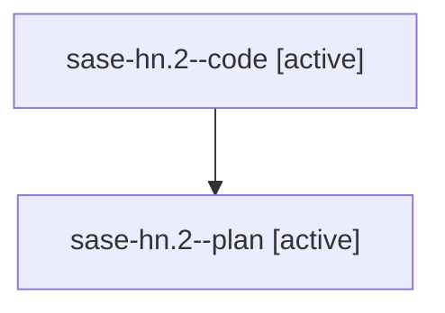

# Family: sase-hn.2

[Agent Hoods](../README.md) / [bbugyi200](../users/bbugyi200/README.md) / [athena](../users/bbugyi200/machines/athena/README.md) / [sase-hn](../users/bbugyi200/machines/athena/hoods/sase-hn/README.md) / sase-hn.2

Owner: `bbugyi200.athena` · Hood: `sase-hn` · Members: 2 · Bead: [sase-hn.2](https://github.com/sase-org/sase--beads/blob/main/pages/sase-hn/sase-hn.2.md)

## Lineage

The diagram is an optional enhancement; the ordered table below contains the same lineage in accessible text.

| Role | Agent | State | Model / provider | Timing | Commits | Prompt | Chat |
|---|---|---|---|---|---:|---|---|
| code | sase-hn.2--code | active | gpt-5.5 / codex | 2026-08-08T17:46:46.847930+00:00 | 0 | — | — |
| plan | sase-hn.2--plan | active | gpt-5.6-sol / codex | 2026-08-08T17:42:09.468084+00:00 | 0 | [Prompt](../agents/bbugyi200.athena.sase-hn.2--plan/prompt.md) | [Chat](../agents/bbugyi200.athena.sase-hn.2--plan/chat.md) |

## Neighbors

| Agent | Relation | State |
|---|---|---|
| [sase-hn.1](../agents/bbugyi200.athena.sase-hn.1/README.md) | sase-hn hood | completed |
| [sase-hn.3](../agents/bbugyi200.athena.sase-hn.3/README.md) | sase-hn hood | waiting |
| [sase-hn.4](../agents/bbugyi200.athena.sase-hn.4/README.md) | sase-hn hood | waiting |
| [sase-hn.5](../agents/bbugyi200.athena.sase-hn.5/README.md) | sase-hn hood | waiting |
| [sase-hn.6](../agents/bbugyi200.athena.sase-hn.6/README.md) | sase-hn hood | waiting |
| [sase-hn.7](../agents/bbugyi200.athena.sase-hn.7/README.md) | sase-hn hood | waiting |
| [sase-hn.land](../agents/bbugyi200.athena.sase-hn.land/README.md) | sase-hn hood | waiting |
