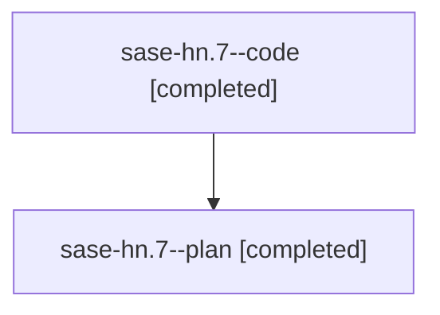

# Family: sase-hn.7

[Agent Hoods](../README.md) / [bbugyi200](../users/bbugyi200/README.md) / [athena](../users/bbugyi200/machines/athena/README.md) / [sase-hn](../users/bbugyi200/machines/athena/hoods/sase-hn/README.md) / sase-hn.7

Owner: `bbugyi200.athena` · Hood: `sase-hn` · Members: 2 · Bead: [sase-hn.7](https://github.com/sase-org/sase--beads/blob/main/pages/sase-hn/sase-hn.7.md)

## Lineage

The diagram is an optional enhancement; the ordered table below contains the same lineage in accessible text.

| Role | Agent | State | Model / provider | Timing | Commits | Prompt | Chat |
|---|---|---|---|---|---:|---|---|
| code | sase-hn.7--code | completed | gpt-5.5 / codex | 2026-08-09T02:42:37.937931+00:00 | [1](../agents/bbugyi200.athena.sase-hn.7--code/README.md#commits) | — | [Chat](../agents/bbugyi200.athena.sase-hn.7--code/chat.md) |
| plan | sase-hn.7--plan | completed | gpt-5.6-sol / codex | 2026-08-09T02:36:09.211823+00:00 | 0 | [Prompt](../agents/bbugyi200.athena.sase-hn.7--plan/prompt.md) | [Chat](../agents/bbugyi200.athena.sase-hn.7--plan/chat.md) |

## Commits

| Role | Repo | Commit | Subject | Committed |
|---|---|---|---|---|
| code | sase | [`db632d7`](https://github.com/sase-org/sase/commit/db632d7fda78ae7d2ebc9a209e057d60943638c3) | feat: audit Patch/stitch compatibility terminology | 2026-08-08 23:56:21 EDT |

## Neighbors

| Agent | Relation | State |
|---|---|---|
| [sase-hn.1](../agents/bbugyi200.athena.sase-hn.1/README.md) | sase-hn hood | completed |
| [sase-hn.2](bbugyi200.athena.sase-hn.2.md) (family · 2) | sase-hn hood | completed 2 |
| [sase-hn.3](bbugyi200.athena.sase-hn.3.md) (family · 2) | sase-hn hood | completed 2 |
| [sase-hn.4](bbugyi200.athena.sase-hn.4.md) (family · 2) | sase-hn hood | completed 2 |
| [sase-hn.5](../agents/bbugyi200.athena.sase-hn.5/README.md) | sase-hn hood | completed |
| [sase-hn.6](../agents/bbugyi200.athena.sase-hn.6/README.md) | sase-hn hood | completed |
| [sase-hn.8.1](../agents/bbugyi200.athena.sase-hn.8.1/README.md) | sase-hn hood | completed |
| [sase-hn.8.2](bbugyi200.athena.sase-hn.8.2.md) (family · 2) | sase-hn hood | completed 2 |
| [sase-hn.8.3](bbugyi200.athena.sase-hn.8.3.md) (family · 2) | sase-hn hood | completed 2 |
| [sase-hn.8.4](../agents/bbugyi200.athena.sase-hn.8.4/README.md) | sase-hn hood | completed |
| [sase-hn.8.5](../agents/bbugyi200.athena.sase-hn.8.5/README.md) | sase-hn hood | completed |
| [sase-hn.8.6.1](../agents/bbugyi200.athena.sase-hn.8.6.1/README.md) | sase-hn hood | active |
| [sase-hn.8.6.2](../agents/bbugyi200.athena.sase-hn.8.6.2/README.md) | sase-hn hood | waiting |
| [sase-hn.8.6.3](../agents/bbugyi200.athena.sase-hn.8.6.3/README.md) | sase-hn hood | waiting |
| [sase-hn.8.6.4](../agents/bbugyi200.athena.sase-hn.8.6.4/README.md) | sase-hn hood | waiting |
| [sase-hn.8.6.land](../agents/bbugyi200.athena.sase-hn.8.6.land/README.md) | sase-hn hood | waiting |
| [sase-hn.8.land](../agents/bbugyi200.athena.sase-hn.8.land/README.md) | sase-hn hood | failed |
| [sase-hn.land](../agents/bbugyi200.athena.sase-hn.land/README.md) | sase-hn hood | failed |
