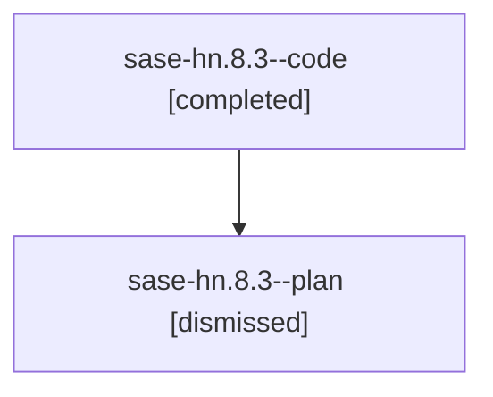

# Family: sase-hn.8.3

[Agent Hoods](../README.md) / [bbugyi200](../users/bbugyi200/README.md) / [athena](../users/bbugyi200/machines/athena/README.md) / [sase-hn](../users/bbugyi200/machines/athena/hoods/sase-hn/README.md) / sase-hn.8.3

Owner: `bbugyi200.athena` · Hood: `sase-hn` · Members: 2 · Bead: [sase-hn.8.3](https://github.com/sase-org/sase--beads/blob/main/pages/sase-hn/sase-hn.8.3.md)

## Lineage

The diagram is an optional enhancement; the ordered table below contains the same lineage in accessible text.

| Role | Agent | State | Model / provider | Timing | Commits | Prompt | Chat |
|---|---|---|---|---|---:|---|---|
| code | sase-hn.8.3--code | completed | gpt-5.5 / codex | 2026-08-09T04:38:24.997570+00:00 | 0 | — | [Chat](../agents/bbugyi200.athena.sase-hn.8.3--code/chat.md) |
| plan | sase-hn.8.3--plan | dismissed | gpt-5.6-sol / codex | 2026-08-09T00:29:44.527358 → 2026-08-09T02:18:17.389213 | 0 | — | [Chat](../agents/bbugyi200.athena.sase-hn.8.3--plan/chat.md) |

## Commits

| Role | Repo | Commit | Subject | Committed |
|---|---|---|---|---|
| — | sase | [`77d18c3`](https://github.com/sase-org/sase/commit/77d18c3e1456e03944278b8d34e030bca7838200) | feat(cli): adopt Patch terminology across workflows | 2026-08-09 02:16:28 EDT |

## Neighbors

| Agent | Relation | State |
|---|---|---|
| [sase-hn.8.1](../agents/bbugyi200.athena.sase-hn.8.1/README.md) | sase-hn.8 hood | dismissed |
| [sase-hn.8.2](bbugyi200.athena.sase-hn.8.2.md) (family · 2) | sase-hn.8 hood | completed 1, dismissed 1 |
| [sase-hn.8.4](../agents/bbugyi200.athena.sase-hn.8.4/README.md) | sase-hn.8 hood | dismissed |
| [sase-hn.8.5](../agents/bbugyi200.athena.sase-hn.8.5/README.md) | sase-hn.8 hood | dismissed |
| [sase-hn.8.6.1](../agents/bbugyi200.athena.sase-hn.8.6.1/README.md) | sase-hn.8 hood | dismissed |
| [sase-hn.8.6.2](bbugyi200.athena.sase-hn.8.6.2.md) (family · 2) | sase-hn.8 hood | completed 1, dismissed 1 |
| [sase-hn.8.6.3](../agents/bbugyi200.athena.sase-hn.8.6.3/README.md) | sase-hn.8 hood | dismissed |
| [sase-hn.8.6.4](../agents/bbugyi200.athena.sase-hn.8.6.4/README.md) | sase-hn.8 hood | dismissed |
| [sase-hn.8.6.land](bbugyi200.athena.sase-hn.8.6.land.md) (family · 2) | sase-hn.8 hood | completed 1, dismissed 1 |
| [sase-hn.8.land](../agents/bbugyi200.athena.sase-hn.8.land/README.md) | sase-hn.8 hood | dismissed |
| [sase-hn.1](../agents/bbugyi200.athena.sase-hn.1/README.md) | sase-hn hood | dismissed |
| [sase-hn.2](bbugyi200.athena.sase-hn.2.md) (family · 2) | sase-hn hood | completed 1, dismissed 1 |
| [sase-hn.3](bbugyi200.athena.sase-hn.3.md) (family · 2) | sase-hn hood | completed 1, dismissed 1 |
| [sase-hn.4](bbugyi200.athena.sase-hn.4.md) (family · 2) | sase-hn hood | completed 1, dismissed 1 |
| [sase-hn.5](../agents/bbugyi200.athena.sase-hn.5/README.md) | sase-hn hood | dismissed |
| [sase-hn.6](../agents/bbugyi200.athena.sase-hn.6/README.md) | sase-hn hood | dismissed |
| [sase-hn.7](bbugyi200.athena.sase-hn.7.md) (family · 2) | sase-hn hood | completed 1, dismissed 1 |
| [sase-hn.land](../agents/bbugyi200.athena.sase-hn.land/README.md) | sase-hn hood | dismissed |
