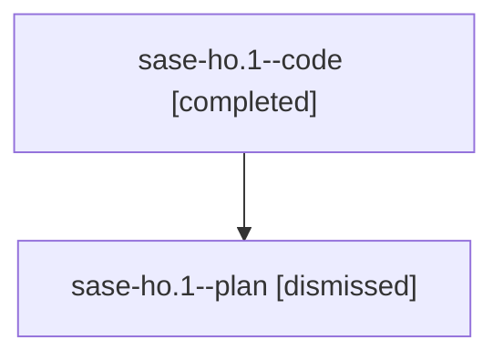

# Family: sase-ho.1

[Agent Hoods](../README.md) / [bbugyi200](../users/bbugyi200/README.md) / [athena](../users/bbugyi200/machines/athena/README.md) / [sase-ho](../users/bbugyi200/machines/athena/hoods/sase-ho/README.md) / sase-ho.1

Owner: `bbugyi200.athena` · Hood: `sase-ho` · Members: 2 · Bead: [sase-ho.1](https://github.com/sase-org/sase--beads/blob/main/pages/sase-ho/sase-ho.1.md)

## Lineage

The diagram is an optional enhancement; the ordered table below contains the same lineage in accessible text.

| Role | Agent | State | Model / provider | Timing | Commits | Prompt | Chat |
|---|---|---|---|---|---:|---|---|
| code | sase-ho.1--code | completed | gpt-5.5 / codex | 2026-08-08T17:46:08.744485+00:00 | 0 | — | [Chat](../agents/bbugyi200.athena.sase-ho.1--code/chat.md) |
| plan | sase-ho.1--plan | dismissed | gpt-5.6-sol / codex | 2026-08-08T13:40:58.196269 → 2026-08-08T14:38:13.835749 | 0 | — | [Chat](../agents/bbugyi200.athena.sase-ho.1--plan/chat.md) |

## Neighbors

| Agent | Relation | State |
|---|---|---|
| [sase-ho.2](bbugyi200.athena.sase-ho.2.md) (family · 2) | sase-ho hood | completed 1, dismissed 1 |
| [sase-ho.2](../agents/bbugyi200.athena.sase-ho.2/README.md) | sase-ho hood | waiting |
| [sase-ho.3](../agents/bbugyi200.athena.sase-ho.3/README.md) | sase-ho hood | dismissed |
| [sase-ho.4](../agents/bbugyi200.athena.sase-ho.4/README.md) | sase-ho hood | dismissed |
| [sase-ho.5](../agents/bbugyi200.athena.sase-ho.5/README.md) | sase-ho hood | dismissed |
| [sase-ho.land](../agents/bbugyi200.athena.sase-ho.land/README.md) | sase-ho hood | dismissed |
