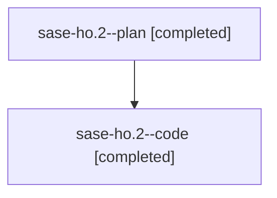

# Family: sase-ho.2

[Agent Hoods](../README.md) / [bbugyi200](../users/bbugyi200/README.md) / [athena](../users/bbugyi200/machines/athena/README.md) / [sase-ho](../users/bbugyi200/machines/athena/hoods/sase-ho/README.md) / sase-ho.2

Owner: `bbugyi200.athena` · Hood: `sase-ho` · Members: 2 · Bead: [sase-ho.2](https://github.com/sase-org/sase--beads/blob/main/pages/sase-ho/sase-ho.2.md)

## Lineage

The diagram is an optional enhancement; the ordered table below contains the same lineage in accessible text.

| Role | Agent | State | Model / provider | Timing | Commits | Prompt | Chat |
|---|---|---|---|---|---:|---|---|
| plan | sase-ho.2--plan | completed | gpt-5.6-sol / codex | 2026-08-08T19:42:44.079613+00:00 | 0 | [Prompt](../agents/bbugyi200.athena.sase-ho.2--plan/prompt.md) | [Chat](../agents/bbugyi200.athena.sase-ho.2--plan/chat.md) |
| code | sase-ho.2--code | completed | gpt-5.5 / codex | 2026-08-08T19:50:51.584156+00:00 | [1](../agents/bbugyi200.athena.sase-ho.2--code/README.md#commits) | — | [Chat](../agents/bbugyi200.athena.sase-ho.2--code/chat.md) |

## Commits

| Role | Repo | Commit | Subject | Committed |
|---|---|---|---|---|
| code | sase | [`e007352`](https://github.com/sase-org/sase/commit/e0073528f2055f39a9d634b7c3096563c50465ed) | feat: add Python ref registry | 2026-08-08 17:00:59 EDT |

## Neighbors

| Agent | Relation | State |
|---|---|---|
| [sase-ho.1](bbugyi200.athena.sase-ho.1.md) (family · 2) | sase-ho hood | completed 2 |
| [sase-ho.3](../agents/bbugyi200.athena.sase-ho.3/README.md) | sase-ho hood | completed |
| [sase-ho.4](../agents/bbugyi200.athena.sase-ho.4/README.md) | sase-ho hood | completed |
| [sase-ho.5](../agents/bbugyi200.athena.sase-ho.5/README.md) | sase-ho hood | completed |
| [sase-ho.land](../agents/bbugyi200.athena.sase-ho.land/README.md) | sase-ho hood | active |
