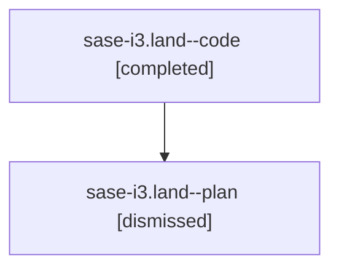

# Family: sase-i3.land

[Agent Hoods](../README.md) / [bbugyi200](../users/bbugyi200/README.md) / [athena](../users/bbugyi200/machines/athena/README.md) / [sase-i3](../users/bbugyi200/machines/athena/hoods/sase-i3/README.md) / sase-i3.land

Owner: `bbugyi200.athena` · Hood: `sase-i3` · Members: 2 · Bead: [sase-i3](https://github.com/sase-org/sase--beads/blob/main/pages/sase-i3/README.md)

## Lineage

The diagram is an optional enhancement; the ordered table below contains the same lineage in accessible text.

| Role | Agent | State | Model / provider | Timing | Commits | Prompt | Chat |
|---|---|---|---|---|---:|---|---|
| code | sase-i3.land--code | completed | gpt-5.5 / codex | 2026-08-09T13:35:24.425555+00:00 | [1](../agents/bbugyi200.athena.sase-i3.land--code/README.md#commits) | — | [Chat](../agents/bbugyi200.athena.sase-i3.land--code/chat.md) |
| plan | sase-i3.land--plan | dismissed | gpt-5.6-sol / codex | 2026-08-09T09:22:19.004070 → 2026-08-09T09:55:46.082370 | 0 | — | [Chat](../agents/bbugyi200.athena.sase-i3.land--plan/chat.md) |

## Commits

| Role | Repo | Commit | Subject | Committed |
|---|---|---|---|---|
| code | sase | [`a764618`](https://github.com/sase-org/sase/commit/a76461812e1fdf1a6661dbb790bd8fc54ed95300) | test(glossary): include display aliases in prompt fixture | 2026-08-09 13:50:01 UTC |

## Neighbors

| Agent | Relation | State |
|---|---|---|
| [sase-i3.1](../agents/bbugyi200.athena.sase-i3.1/README.md) | sase-i3 hood | dismissed |
| [sase-i3.2](../agents/bbugyi200.athena.sase-i3.2/README.md) | sase-i3 hood | dismissed |
| [sase-i3.3](../agents/bbugyi200.athena.sase-i3.3/README.md) | sase-i3 hood | dismissed |
