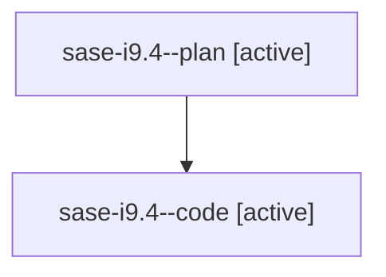

# Family: sase-i9.4

[Agent Hoods](../README.md) / [bbugyi200](../users/bbugyi200/README.md) / [athena](../users/bbugyi200/machines/athena/README.md) / [sase-i9](../users/bbugyi200/machines/athena/hoods/sase-i9/README.md) / sase-i9.4

Owner: `bbugyi200.athena` · Hood: `sase-i9` · Members: 2 · Bead: [sase-i9.4](https://github.com/sase-org/sase--beads/blob/main/pages/sase-i9/sase-i9.4.md)

## Lineage

The diagram is an optional enhancement; the ordered table below contains the same lineage in accessible text.

| Role | Agent | State | Model / provider | Timing | Commits | Prompt | Chat |
|---|---|---|---|---|---:|---|---|
| plan | sase-i9.4--plan | active | gpt-5.6-sol / codex | 2026-08-09T16:52:01.417566+00:00 | 0 | [Prompt](../agents/bbugyi200.athena.sase-i9.4--plan/prompt.md) | [Chat](../agents/bbugyi200.athena.sase-i9.4--plan/chat.md) |
| code | sase-i9.4--code | active | gpt-5.5 / codex | 2026-08-09T17:01:15.421235+00:00 | 0 | — | — |

## Neighbors

| Agent | Relation | State |
|---|---|---|
| [sase-i9.1](../agents/bbugyi200.athena.sase-i9.1/README.md) | sase-i9 hood | completed |
| [sase-i9.2](../agents/bbugyi200.athena.sase-i9.2/README.md) | sase-i9 hood | completed |
| [sase-i9.3](../agents/bbugyi200.athena.sase-i9.3/README.md) | sase-i9 hood | completed |
| [sase-i9.5](../agents/bbugyi200.athena.sase-i9.5/README.md) | sase-i9 hood | waiting |
| [sase-i9.land](../agents/bbugyi200.athena.sase-i9.land/README.md) | sase-i9 hood | waiting |
