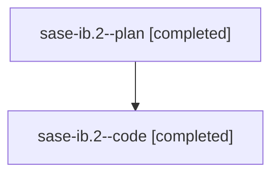

# Family: sase-ib.2

[Agent Hoods](../README.md) / [bbugyi200](../users/bbugyi200/README.md) / [athena](../users/bbugyi200/machines/athena/README.md) / [sase-ib](../users/bbugyi200/machines/athena/hoods/sase-ib/README.md) / sase-ib.2

Owner: `bbugyi200.athena` · Hood: `sase-ib` · Members: 2 · Bead: [sase-ib.2](https://github.com/sase-org/sase--beads/blob/main/pages/sase-ib/sase-ib.2.md)

## Lineage

The diagram is an optional enhancement; the ordered table below contains the same lineage in accessible text.

| Role | Agent | State | Model / provider | Timing | Commits | Prompt | Chat |
|---|---|---|---|---|---:|---|---|
| plan | sase-ib.2--plan | completed | gpt-5.6-sol / codex | 2026-08-09T15:26:13.264074+00:00 | 0 | [Prompt](../agents/bbugyi200.athena.sase-ib.2--plan/prompt.md) | [Chat](../agents/bbugyi200.athena.sase-ib.2--plan/chat.md) |
| code | sase-ib.2--code | completed | gpt-5.5 / codex | 2026-08-09T15:32:30.110919+00:00 | 0 | — | [Chat](../agents/bbugyi200.athena.sase-ib.2--code/chat.md) |

## Commits

| Role | Repo | Commit | Subject | Committed |
|---|---|---|---|---|
| — | sase | [`cfe18d7`](https://github.com/sase-org/sase/commit/cfe18d7f0de46080e1a5b9e509845261e543b946) | perf(test): make ACE TUI waits event-driven | 2026-08-09 13:22:25 EDT |

## Neighbors

| Agent | Relation | State |
|---|---|---|
| [sase-ib.1](../agents/bbugyi200.athena.sase-ib.1/README.md) | sase-ib hood | completed |
| [sase-ib.3](bbugyi200.athena.sase-ib.3.md) (family · 2) | sase-ib hood | completed 2 |
| [sase-ib.4](../agents/bbugyi200.athena.sase-ib.4/README.md) | sase-ib hood | completed |
| [sase-ib.5](../agents/bbugyi200.athena.sase-ib.5/README.md) | sase-ib hood | completed |
| [sase-ib.6](../agents/bbugyi200.athena.sase-ib.6/README.md) | sase-ib hood | completed |
| [sase-ib.7](../agents/bbugyi200.athena.sase-ib.7/README.md) | sase-ib hood | completed |
| [sase-ib.land](../agents/bbugyi200.athena.sase-ib.land/README.md) | sase-ib hood | completed |
