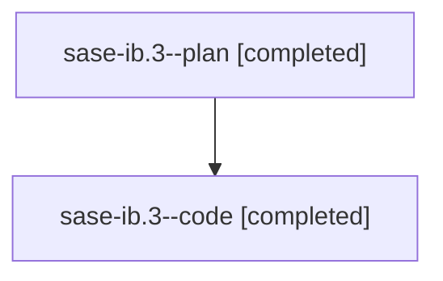

# Family: sase-ib.3

[Agent Hoods](../README.md) / [bbugyi200](../users/bbugyi200/README.md) / [athena](../users/bbugyi200/machines/athena/README.md) / [sase-ib](../users/bbugyi200/machines/athena/hoods/sase-ib/README.md) / sase-ib.3

Owner: `bbugyi200.athena` · Hood: `sase-ib` · Members: 2 · Bead: [sase-ib.3](https://github.com/sase-org/sase--beads/blob/main/pages/sase-ib/sase-ib.3.md)

## Lineage

The diagram is an optional enhancement; the ordered table below contains the same lineage in accessible text.

| Role | Agent | State | Model / provider | Timing | Commits | Prompt | Chat |
|---|---|---|---|---|---:|---|---|
| plan | sase-ib.3--plan | completed | gpt-5.6-sol / codex | 2026-08-09T17:24:40.986822+00:00 | 0 | [Prompt](../agents/bbugyi200.athena.sase-ib.3--plan/prompt.md) | [Chat](../agents/bbugyi200.athena.sase-ib.3--plan/chat.md) |
| code | sase-ib.3--code | completed | gpt-5.5 / codex | 2026-08-09T17:47:11.377749+00:00 | [1](../agents/bbugyi200.athena.sase-ib.3--code/README.md#commits) | — | [Chat](../agents/bbugyi200.athena.sase-ib.3--code/chat.md) |

## Commits

| Role | Repo | Commit | Subject | Committed |
|---|---|---|---|---|
| code | sase | [`44bf25f`](https://github.com/sase-org/sase/commit/44bf25f84fecc2ee32c0c6fc8cf58a642f0f632b) | perf(ace): amortize ACE test app startup | 2026-08-09 14:35:04 EDT |

## Neighbors

| Agent | Relation | State |
|---|---|---|
| [sase-ib.1](../agents/bbugyi200.athena.sase-ib.1/README.md) | sase-ib hood | completed |
| [sase-ib.2](bbugyi200.athena.sase-ib.2.md) (family · 2) | sase-ib hood | completed 2 |
| [sase-ib.4](../agents/bbugyi200.athena.sase-ib.4/README.md) | sase-ib hood | completed |
| [sase-ib.5](../agents/bbugyi200.athena.sase-ib.5/README.md) | sase-ib hood | completed |
| [sase-ib.6](../agents/bbugyi200.athena.sase-ib.6/README.md) | sase-ib hood | completed |
| [sase-ib.7](../agents/bbugyi200.athena.sase-ib.7/README.md) | sase-ib hood | completed |
| [sase-ib.land](../agents/bbugyi200.athena.sase-ib.land/README.md) | sase-ib hood | active |
