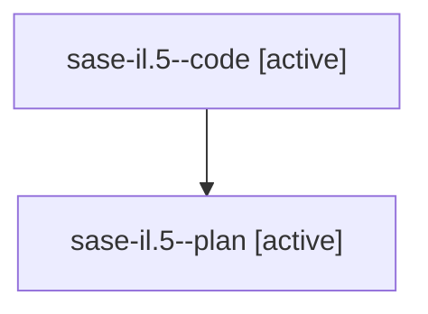

# Family: sase-il.5

[Agent Hoods](../README.md) / [bbugyi200](../users/bbugyi200/README.md) / [athena](../users/bbugyi200/machines/athena/README.md) / [sase-il](../users/bbugyi200/machines/athena/hoods/sase-il/README.md) / sase-il.5

Owner: `bbugyi200.athena` · Hood: `sase-il` · Members: 2 · Bead: [sase-il.5](https://github.com/sase-org/sase--beads/blob/main/pages/sase-il/sase-il.5.md)

## Lineage

The diagram is an optional enhancement; the ordered table below contains the same lineage in accessible text.

| Role | Agent | State | Model / provider | Timing | Commits | Prompt | Chat |
|---|---|---|---|---|---:|---|---|
| code | sase-il.5--code | active | gpt-5.5 / codex | 2026-08-10T12:55:20.449072+00:00 | [1](../agents/bbugyi200.athena.sase-il.5--code/README.md#commits) | — | — |
| plan | sase-il.5--plan | active | gpt-5.6-sol / codex | 2026-08-10T12:50:50.002067+00:00 | 0 | [Prompt](../agents/bbugyi200.athena.sase-il.5--plan/prompt.md) | [Chat](../agents/bbugyi200.athena.sase-il.5--plan/chat.md) |

## Commits

| Role | Repo | Commit | Subject | Committed |
|---|---|---|---|---|
| code | sase | [`344a0b8`](https://github.com/sase-org/sase/commit/344a0b8ff2da71bc53123f008fde5ab08c1bef3a) | feat!: retire implicit coder model aliases | 2026-08-10 10:35:10 EDT |

## Neighbors

| Agent | Relation | State |
|---|---|---|
| [sase-il.1](../agents/bbugyi200.athena.sase-il.1/README.md) | sase-il hood | completed |
| [sase-il.2](../agents/bbugyi200.athena.sase-il.2/README.md) | sase-il hood | completed |
| [sase-il.3](../agents/bbugyi200.athena.sase-il.3/README.md) | sase-il hood | completed |
| [sase-il.4](../agents/bbugyi200.athena.sase-il.4/README.md) | sase-il hood | completed |
| [sase-il.6](../agents/bbugyi200.athena.sase-il.6/README.md) | sase-il hood | completed |
| [sase-il.land](../agents/bbugyi200.athena.sase-il.land/README.md) | sase-il hood | waiting |
| [sase-il.land.f0](../agents/bbugyi200.athena.sase-il.land.f0/README.md) | sase-il hood | waiting |
| [sase-il.land.w0](../agents/bbugyi200.athena.sase-il.land.w0/README.md) | sase-il hood | waiting |
