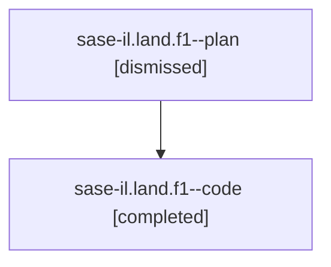

# Family: sase-il.land.f1

[Agent Hoods](../README.md) / [bbugyi200](../users/bbugyi200/README.md) / [athena](../users/bbugyi200/machines/athena/README.md) / [sase-il](../users/bbugyi200/machines/athena/hoods/sase-il/README.md) / sase-il.land.f1

Owner: `bbugyi200.athena` · Hood: `sase-il` · Members: 2

## Lineage

The diagram is an optional enhancement; the ordered table below contains the same lineage in accessible text.

| Role | Agent | State | Model / provider | Timing | Commits | Prompt | Chat |
|---|---|---|---|---|---:|---|---|
| plan | sase-il.land.f1--plan | dismissed | opus / claude | 2026-08-10T10:54:39.625777 → 2026-08-10T11:28:19.719577 | 0 | — | [Chat](../agents/bbugyi200.athena.sase-il.land.f1--plan/chat.md) |
| code | sase-il.land.f1--code | completed | gpt-5.5 / codex | 2026-08-10T15:00:28.053885+00:00 | [1](../agents/bbugyi200.athena.sase-il.land.f1--code/README.md#commits) | — | [Chat](../agents/bbugyi200.athena.sase-il.land.f1--code/chat.md) |

## Commits

| Role | Repo | Commit | Subject | Committed |
|---|---|---|---|---|
| code | sase | [`7aebbe6`](https://github.com/sase-org/sase/commit/7aebbe6ff5ac3be77449dd4a547450ccffb86024) | feat: show tale size in plan displays | 2026-08-10 15:26:19 UTC |

## Neighbors

| Agent | Relation | State |
|---|---|---|
| [sase-il.land](../agents/bbugyi200.athena.sase-il.land/README.md) | ancestor | dismissed |
| [sase-il.land.w1](bbugyi200.athena.sase-il.land.w1.md) (family · 3) | sase-il.land hood | active 3 |
| [sase-il.1](../agents/bbugyi200.athena.sase-il.1/README.md) | sase-il hood | dismissed |
| [sase-il.2](../agents/bbugyi200.athena.sase-il.2/README.md) | sase-il hood | dismissed |
| [sase-il.3](../agents/bbugyi200.athena.sase-il.3/README.md) | sase-il hood | dismissed |
| [sase-il.4](../agents/bbugyi200.athena.sase-il.4/README.md) | sase-il hood | dismissed |
| [sase-il.5](bbugyi200.athena.sase-il.5.md) (family · 2) | sase-il hood | completed 1, dismissed 1 |
| [sase-il.6](../agents/bbugyi200.athena.sase-il.6/README.md) | sase-il hood | dismissed |
| [sase-il.7.1](../agents/bbugyi200.athena.sase-il.7.1/README.md) | sase-il hood | dismissed |
| [sase-il.7.2](../agents/bbugyi200.athena.sase-il.7.2/README.md) | sase-il hood | dismissed |
| [sase-il.7.3](../agents/bbugyi200.athena.sase-il.7.3/README.md) | sase-il hood | dismissed |
| [sase-il.7.land](../agents/bbugyi200.athena.sase-il.7.land/README.md) | sase-il hood | dismissed |
