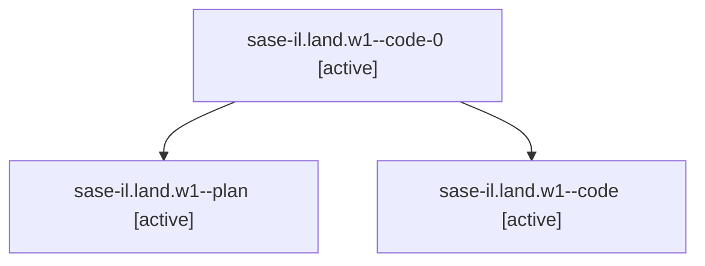

# Family: sase-il.land.w1

[Agent Hoods](../README.md) / [bbugyi200](../users/bbugyi200/README.md) / [athena](../users/bbugyi200/machines/athena/README.md) / [sase-il](../users/bbugyi200/machines/athena/hoods/sase-il/README.md) / sase-il.land.w1

Owner: `bbugyi200.athena` · Hood: `sase-il` · Members: 3

## Lineage

The diagram is an optional enhancement; the ordered table below contains the same lineage in accessible text.

| Role | Agent | State | Model / provider | Timing | Commits | Prompt | Chat |
|---|---|---|---|---|---:|---|---|
| code-0 | sase-il.land.w1--code-0 | active | gpt-5.5 / codex | 2026-08-10T15:06:33.367933+00:00 | 0 | — | — |
| plan | sase-il.land.w1--plan | active | opus / claude | 2026-08-10T14:54:29.934936+00:00 | 0 | [Prompt](../agents/bbugyi200.athena.sase-il.land.w1--plan/prompt.md) | [Chat](../agents/bbugyi200.athena.sase-il.land.w1--plan/chat.md) |
| code | sase-il.land.w1--code | active | gpt-5.5 / codex | 2026-08-10T15:02:48.345147+00:00 | 0 | — | [Chat](../agents/bbugyi200.athena.sase-il.land.w1--code/chat.md) |

## Neighbors

| Agent | Relation | State |
|---|---|---|
| [sase-il.land](../agents/bbugyi200.athena.sase-il.land/README.md) | ancestor | dismissed |
| [sase-il.land.f1](bbugyi200.athena.sase-il.land.f1.md) (family · 2) | sase-il.land hood | completed 1, dismissed 1 |
| [sase-il.1](../agents/bbugyi200.athena.sase-il.1/README.md) | sase-il hood | dismissed |
| [sase-il.2](../agents/bbugyi200.athena.sase-il.2/README.md) | sase-il hood | dismissed |
| [sase-il.3](../agents/bbugyi200.athena.sase-il.3/README.md) | sase-il hood | dismissed |
| [sase-il.4](../agents/bbugyi200.athena.sase-il.4/README.md) | sase-il hood | dismissed |
| [sase-il.5](bbugyi200.athena.sase-il.5.md) (family · 2) | sase-il hood | completed 1, dismissed 1 |
| [sase-il.6](../agents/bbugyi200.athena.sase-il.6/README.md) | sase-il hood | dismissed |
| [sase-il.7.1](../agents/bbugyi200.athena.sase-il.7.1/README.md) | sase-il hood | dismissed |
| [sase-il.7.2](../agents/bbugyi200.athena.sase-il.7.2/README.md) | sase-il hood | dismissed |
| [sase-il.7.3](../agents/bbugyi200.athena.sase-il.7.3/README.md) | sase-il hood | dismissed |
| [sase-il.7.land](../agents/bbugyi200.athena.sase-il.7.land/README.md) | sase-il hood | dismissed |
