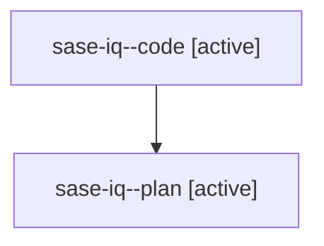

# Family: sase-iq

[Agent Hoods](../README.md) / [bbugyi200](../users/bbugyi200/README.md) / [athena](../users/bbugyi200/machines/athena/README.md) / [sase-iq](../users/bbugyi200/machines/athena/hoods/sase-iq/README.md) / sase-iq

Owner: `bbugyi200.athena` · Hood: `sase-iq` · Members: 2 · Bead: [sase-iq](https://github.com/sase-org/sase--beads/blob/main/pages/sase-iq/README.md)

## Lineage

The diagram is an optional enhancement; the ordered table below contains the same lineage in accessible text.

| Role | Agent | State | Model / provider | Timing | Commits | Prompt | Chat |
|---|---|---|---|---|---:|---|---|
| code | sase-iq--code | active | gpt-5.5 / codex | 2026-08-10T14:15:00.358652+00:00 | [1](../agents/bbugyi200.athena.sase-iq--code/README.md#commits) | — | — |
| plan | sase-iq--plan | active | gpt-5.6-sol / codex | 2026-08-10T14:11:44.697024+00:00 | 0 | [Prompt](../agents/bbugyi200.athena.sase-iq--plan/prompt.md) | [Chat](../agents/bbugyi200.athena.sase-iq--plan/chat.md) |

## Commits

| Role | Repo | Commit | Subject | Committed |
|---|---|---|---|---|
| code | sase | [`1417de7`](https://github.com/sase-org/sase/commit/1417de7dbcda8fd863c347f10ab8a8ef4882834d) | test: update cost mode recorder contracts | 2026-08-10 10:27:03 EDT |
