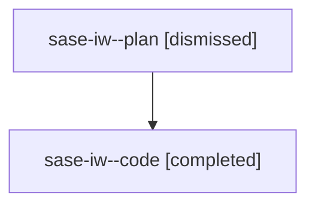

# Family: sase-iw

[Agent Hoods](../README.md) / [bbugyi200](../users/bbugyi200/README.md) / [athena](../users/bbugyi200/machines/athena/README.md) / [sase-iw](../users/bbugyi200/machines/athena/hoods/sase-iw/README.md) / sase-iw

Owner: `bbugyi200.athena` · Hood: `sase-iw` · Members: 2 · Bead: [sase-iw](https://github.com/sase-org/sase--beads/blob/main/pages/sase-iw/README.md)

## Lineage

The diagram is an optional enhancement; the ordered table below contains the same lineage in accessible text.

| Role | Agent | State | Model / provider | Timing | Commits | Prompt | Chat |
|---|---|---|---|---|---:|---|---|
| plan | sase-iw--plan | dismissed | gpt-5.6-sol / codex | 2026-08-10T10:48:55.316651 → 2026-08-10T11:19:03.892532 | 0 | — | [Chat](../agents/bbugyi200.athena.sase-iw--plan/chat.md) |
| code | sase-iw--code | completed | gpt-5.5 / codex | 2026-08-10T14:54:35.421235+00:00 | [1](../agents/bbugyi200.athena.sase-iw--code/README.md#commits) | — | [Chat](../agents/bbugyi200.athena.sase-iw--code/chat.md) |

## Commits

| Role | Repo | Commit | Subject | Committed |
|---|---|---|---|---|
| code | sase | [`6e17536`](https://github.com/sase-org/sase/commit/6e1753647c7ad0bfdd6d29c92ad2d8da1e381021) | fix(lint): type-check extensionless tool scripts | 2026-08-10 11:15:49 EDT |
