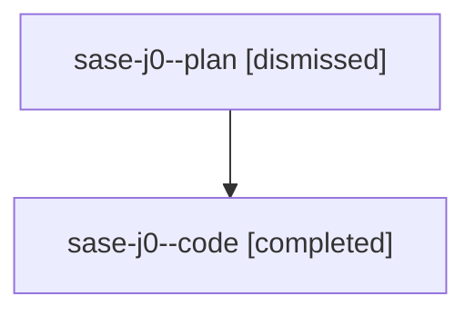

# Family: sase-j0

[Agent Hoods](../README.md) / [bbugyi200](../users/bbugyi200/README.md) / [athena](../users/bbugyi200/machines/athena/README.md) / [sase-j0](../users/bbugyi200/machines/athena/hoods/sase-j0/README.md) / sase-j0

Owner: `bbugyi200.athena` · Hood: `sase-j0` · Members: 2 · Bead: [sase-j0](https://github.com/sase-org/sase--beads/blob/main/pages/sase-j0/README.md)

## Lineage

The diagram is an optional enhancement; the ordered table below contains the same lineage in accessible text.

| Role | Agent | State | Model / provider | Timing | Commits | Prompt | Chat |
|---|---|---|---|---|---:|---|---|
| plan | sase-j0--plan | dismissed | gpt-5.6-sol / codex | 2026-08-11T11:46:53.002335 → 2026-08-11T12:41:01.044580 | 0 | — | [Chat](../agents/bbugyi200.athena.sase-j0--plan/chat.md) |
| code | sase-j0--code | completed | sonnet / claude | 2026-08-11T16:02:18.748527+00:00 | [1](../agents/bbugyi200.athena.sase-j0--code/README.md#commits) | — | [Chat](../agents/bbugyi200.athena.sase-j0--code/chat.md) |

## Commits

| Role | Repo | Commit | Subject | Committed |
|---|---|---|---|---|
| — | sase | [`c8e4016`](https://github.com/sase-org/sase/commit/c8e4016c7c5e169b77fd4bfadd9170e71c2a1ca2) | fix(test-cost): recalibrate suite-cost budgets against real recorded history | 2026-08-10 18:58:48 UTC |
| code | sase | [`9cb81b3`](https://github.com/sase-org/sase/commit/9cb81b3b0dde3af6c4bd66260e9d382785feec65) | feat(test-cost): add width-invariant worker-RSS summary keys | 2026-08-11 16:39:33 UTC |

## Neighbors

| Agent | Relation | State |
|---|---|---|
| [sase-j0.w1](bbugyi200.athena.sase-j0.w1.md) (family · 2) | descendant | completed 1, dismissed 1 |
| [sase-j0.w1.f0](../agents/bbugyi200.athena.sase-j0.w1.f0/README.md) | descendant | dismissed |
