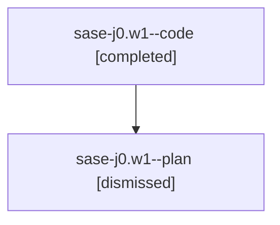

# Family: sase-j0.w1

[Agent Hoods](../README.md) / [bbugyi200](../users/bbugyi200/README.md) / [athena](../users/bbugyi200/machines/athena/README.md) / [sase-j0](../users/bbugyi200/machines/athena/hoods/sase-j0/README.md) / sase-j0.w1

Owner: `bbugyi200.athena` · Hood: `sase-j0` · Members: 2

## Lineage

The diagram is an optional enhancement; the ordered table below contains the same lineage in accessible text.

| Role | Agent | State | Model / provider | Timing | Commits | Prompt | Chat |
|---|---|---|---|---|---:|---|---|
| code | sase-j0.w1--code | completed | sonnet / claude | 2026-08-10T19:10:37.643537+00:00 | [1](../agents/bbugyi200.athena.sase-j0.w1--code/README.md#commits) | — | [Chat](../agents/bbugyi200.athena.sase-j0.w1--code/chat.md) |
| plan | sase-j0.w1--plan | dismissed | opus / claude | 2026-08-10T15:00:23.438739 → 2026-08-10T15:24:23.034265 | 0 | — | [Chat](../agents/bbugyi200.athena.sase-j0.w1--plan/chat.md) |

## Commits

| Role | Repo | Commit | Subject | Committed |
|---|---|---|---|---|
| code | sase | [`83bb8a6`](https://github.com/sase-org/sase/commit/83bb8a6f775b6e762de4a3fd2ad9e4e577b5a786) | test: bump flake-baseline cutoff past sase-iy mechanism fixes | 2026-08-10 15:12:44 EDT |

## Neighbors

| Agent | Relation | State |
|---|---|---|
| [sase-j0](bbugyi200.athena.sase-j0.md) (family · 2) | ancestor | active 2 |
| [sase-j0.w1.f0](../agents/bbugyi200.athena.sase-j0.w1.f0/README.md) | descendant | dismissed |
