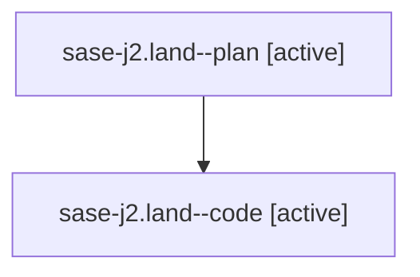

# Family: sase-j2.land

[Agent Hoods](../README.md) / [bbugyi200](../users/bbugyi200/README.md) / [athena](../users/bbugyi200/machines/athena/README.md) / [sase-j2](../users/bbugyi200/machines/athena/hoods/sase-j2/README.md) / sase-j2.land

Owner: `bbugyi200.athena` · Hood: `sase-j2` · Members: 2 · Bead: [sase-j2](https://github.com/sase-org/sase--beads/blob/main/pages/sase-j2/README.md)

## Lineage

The diagram is an optional enhancement; the ordered table below contains the same lineage in accessible text.

| Role | Agent | State | Model / provider | Timing | Commits | Prompt | Chat |
|---|---|---|---|---|---:|---|---|
| plan | sase-j2.land--plan | active | gpt-5.6-sol / codex | 2026-08-10T19:28:30.986849+00:00 | 0 | [Prompt](../agents/bbugyi200.athena.sase-j2.land--plan/prompt.md) | [Chat](../agents/bbugyi200.athena.sase-j2.land--plan/chat.md) |
| code | sase-j2.land--code | active | sonnet / claude | 2026-08-10T19:41:31.825396+00:00 | 0 | — | — |

## Neighbors

| Agent | Relation | State |
|---|---|---|
| [sase-j2.1](../agents/bbugyi200.athena.sase-j2.1/README.md) | sase-j2 hood | completed |
| [sase-j2.2](../agents/bbugyi200.athena.sase-j2.2/README.md) | sase-j2 hood | completed |
