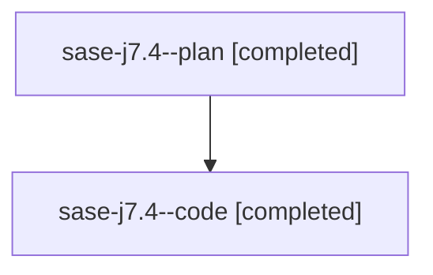

# Family: sase-j7.4

[Agent Hoods](../README.md) / [bbugyi200](../users/bbugyi200/README.md) / [athena](../users/bbugyi200/machines/athena/README.md) / [sase-j7](../users/bbugyi200/machines/athena/hoods/sase-j7/README.md) / sase-j7.4

Owner: `bbugyi200.athena` · Hood: `sase-j7` · Members: 2 · Bead: [sase-j7.4](https://github.com/sase-org/sase--beads/blob/main/pages/sase-j7/sase-j7.4.md)

## Lineage

The diagram is an optional enhancement; the ordered table below contains the same lineage in accessible text.

| Role | Agent | State | Model / provider | Timing | Commits | Prompt | Chat |
|---|---|---|---|---|---:|---|---|
| plan | sase-j7.4--plan | completed | opus / claude | 2026-08-10T21:27:36.575461+00:00 | 0 | [Prompt](../agents/bbugyi200.athena.sase-j7.4--plan/prompt.md) | [Chat](../agents/bbugyi200.athena.sase-j7.4--plan/chat.md) |
| code | sase-j7.4--code | completed | gpt-5.5 / codex | 2026-08-10T21:34:09.660328+00:00 | 0 | — | [Chat](../agents/bbugyi200.athena.sase-j7.4--code/chat.md) |

## Commits

| Role | Repo | Commit | Subject | Committed |
|---|---|---|---|---|
| — | sase | [`6385a8e`](https://github.com/sase-org/sase/commit/6385a8ebb16d6315b2fd74fd4ef47b630f516ace) | test: gate cost lane on global-state leak detector | 2026-08-10 20:14:05 EDT |

## Neighbors

| Agent | Relation | State |
|---|---|---|
| [sase-j7.1](../agents/bbugyi200.athena.sase-j7.1/README.md) | sase-j7 hood | completed |
| [sase-j7.2](../agents/bbugyi200.athena.sase-j7.2/README.md) | sase-j7 hood | completed |
| [sase-j7.3](../agents/bbugyi200.athena.sase-j7.3/README.md) | sase-j7 hood | completed |
| [sase-j7.5](../agents/bbugyi200.athena.sase-j7.5/README.md) | sase-j7 hood | active |
| [sase-j7.land](../agents/bbugyi200.athena.sase-j7.land/README.md) | sase-j7 hood | waiting |
