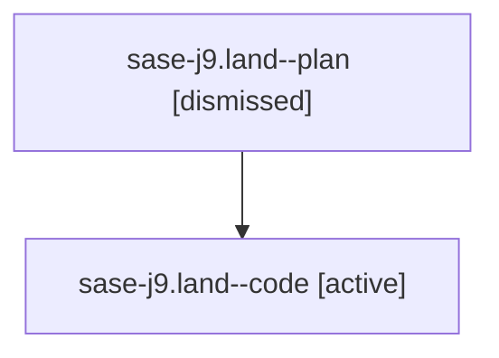

# Family: sase-j9.land

[Agent Hoods](../README.md) / [bbugyi200](../users/bbugyi200/README.md) / [athena](../users/bbugyi200/machines/athena/README.md) / [sase-j9](../users/bbugyi200/machines/athena/hoods/sase-j9/README.md) / sase-j9.land

Owner: `bbugyi200.athena` · Hood: `sase-j9` · Members: 2 · Bead: [sase-j9](https://github.com/sase-org/sase--beads/blob/main/pages/sase-j9/README.md)

## Lineage

The diagram is an optional enhancement; the ordered table below contains the same lineage in accessible text.

| Role | Agent | State | Model / provider | Timing | Commits | Prompt | Chat |
|---|---|---|---|---|---:|---|---|
| plan | sase-j9.land--plan | dismissed | opus / claude | 2026-08-10T20:05:07.620172 | 0 | — | — |
| code | sase-j9.land--code | active | sonnet / claude | 2026-08-11T00:18:38.423415+00:00 | [1](../agents/bbugyi200.athena.sase-j9.land--code/README.md#commits) | — | — |

## Commits

| Role | Repo | Commit | Subject | Committed |
|---|---|---|---|---|
| code | sase | [`81e7b02`](https://github.com/sase-org/sase/commit/81e7b02d69066377ca0c1f019e4d5467c3471f12) | feat(ace): restrict \`-\` panel fold sweep to lanes/clans only | 2026-08-10 21:42:59 EDT |

## Neighbors

| Agent | Relation | State |
|---|---|---|
| [sase-j9.1](../agents/bbugyi200.athena.sase-j9.1/README.md) | sase-j9 hood | dismissed |
| [sase-j9.2](../agents/bbugyi200.athena.sase-j9.2/README.md) | sase-j9 hood | dismissed |
