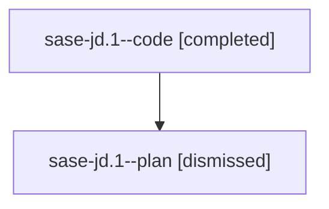

# Family: sase-jd.1

[Agent Hoods](../README.md) / [bbugyi200](../users/bbugyi200/README.md) / [athena](../users/bbugyi200/machines/athena/README.md) / [sase-jd](../users/bbugyi200/machines/athena/hoods/sase-jd/README.md) / sase-jd.1

Owner: `bbugyi200.athena` · Hood: `sase-jd` · Members: 2 · Bead: [sase-jd.1](https://github.com/sase-org/sase--beads/blob/main/pages/sase-jd/sase-jd.1.md)

## Lineage

The diagram is an optional enhancement; the ordered table below contains the same lineage in accessible text.

| Role | Agent | State | Model / provider | Timing | Commits | Prompt | Chat |
|---|---|---|---|---|---:|---|---|
| code | sase-jd.1--code | completed | gpt-5.5 / codex | 2026-08-10T23:24:41.791469+00:00 | 0 | — | [Chat](../agents/bbugyi200.athena.sase-jd.1--code/chat.md) |
| plan | sase-jd.1--plan | dismissed | opus / claude | 2026-08-10T19:17:45.633779 → 2026-08-10T21:14:55.706985 | 0 | — | [Chat](../agents/bbugyi200.athena.sase-jd.1--plan/chat.md) |

## Commits

| Role | Repo | Commit | Subject | Committed |
|---|---|---|---|---|
| — | sase | [`fd93aab`](https://github.com/sase-org/sase/commit/fd93aab1d4c850d10fddb13330108d4e0627a0a1) | feat(beads): surface external refs in Python workflows | 2026-08-11 01:12:20 UTC |

## Neighbors

| Agent | Relation | State |
|---|---|---|
| [sase-jd.2](../agents/bbugyi200.athena.sase-jd.2/README.md) | sase-jd hood | dismissed |
| [sase-jd.3](../agents/bbugyi200.athena.sase-jd.3/README.md) | sase-jd hood | dismissed |
| [sase-jd.4](bbugyi200.athena.sase-jd.4.md) (family · 2) | sase-jd hood | active 1, dismissed 1 |
| [sase-jd.4](../agents/bbugyi200.athena.sase-jd.4/README.md) | sase-jd hood | active |
| [sase-jd.5](bbugyi200.athena.sase-jd.5.md) (family · 2) | sase-jd hood | completed 1, dismissed 1 |
| [sase-jd.6](bbugyi200.athena.sase-jd.6.md) (family · 2) | sase-jd hood | completed 1, dismissed 1 |
| [sase-jd.6](../agents/bbugyi200.athena.sase-jd.6/README.md) | sase-jd hood | active |
| [sase-jd.7](../agents/bbugyi200.athena.sase-jd.7/README.md) | sase-jd hood | dismissed |
| [sase-jd.8](bbugyi200.athena.sase-jd.8.md) (family · 2) | sase-jd hood | active 1, dismissed 1 |
| [sase-jd.land](../agents/bbugyi200.athena.sase-jd.land/README.md) | sase-jd hood | dismissed |
