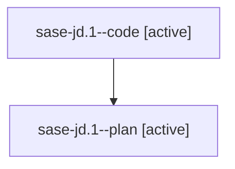

# Family: sase-jd.1

[Agent Hoods](../README.md) / [bbugyi200](../users/bbugyi200/README.md) / [athena](../users/bbugyi200/machines/athena/README.md) / [sase-jd](../users/bbugyi200/machines/athena/hoods/sase-jd/README.md) / sase-jd.1

Owner: `bbugyi200.athena` · Hood: `sase-jd` · Members: 2 · Bead: [sase-jd.1](https://github.com/sase-org/sase--beads/blob/main/pages/sase-jd/sase-jd.1.md)

## Lineage

The diagram is an optional enhancement; the ordered table below contains the same lineage in accessible text.

| Role | Agent | State | Model / provider | Timing | Commits | Prompt | Chat |
|---|---|---|---|---|---:|---|---|
| code | sase-jd.1--code | active | gpt-5.5 / codex | 2026-08-10T23:24:41.791469+00:00 | 0 | — | — |
| plan | sase-jd.1--plan | active | opus / claude | 2026-08-10T23:17:45.633779+00:00 | 0 | [Prompt](../agents/bbugyi200.athena.sase-jd.1--plan/prompt.md) | [Chat](../agents/bbugyi200.athena.sase-jd.1--plan/chat.md) |

## Neighbors

| Agent | Relation | State |
|---|---|---|
| [sase-jd.2](../agents/bbugyi200.athena.sase-jd.2/README.md) | sase-jd hood | completed |
| [sase-jd.3](../agents/bbugyi200.athena.sase-jd.3/README.md) | sase-jd hood | active |
| [sase-jd.4](../agents/bbugyi200.athena.sase-jd.4/README.md) | sase-jd hood | waiting |
| [sase-jd.5](../agents/bbugyi200.athena.sase-jd.5/README.md) | sase-jd hood | waiting |
| [sase-jd.6](../agents/bbugyi200.athena.sase-jd.6/README.md) | sase-jd hood | waiting |
| [sase-jd.7](../agents/bbugyi200.athena.sase-jd.7/README.md) | sase-jd hood | waiting |
| [sase-jd.8](../agents/bbugyi200.athena.sase-jd.8/README.md) | sase-jd hood | waiting |
| [sase-jd.land](../agents/bbugyi200.athena.sase-jd.land/README.md) | sase-jd hood | waiting |
