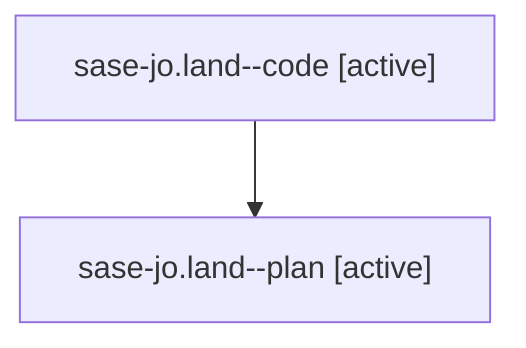

# Family: sase-jo.land

[Agent Hoods](../README.md) / [bbugyi200](../users/bbugyi200/README.md) / [athena](../users/bbugyi200/machines/athena/README.md) / [sase-jo](../users/bbugyi200/machines/athena/hoods/sase-jo/README.md) / sase-jo.land

Owner: `bbugyi200.athena` · Hood: `sase-jo` · Members: 2 · Bead: [sase-jo](https://github.com/sase-org/sase--beads/blob/main/pages/sase-jo/README.md)

## Lineage

The diagram is an optional enhancement; the ordered table below contains the same lineage in accessible text.

| Role | Agent | State | Model / provider | Timing | Commits | Prompt | Chat |
|---|---|---|---|---|---:|---|---|
| code | sase-jo.land--code | active | sonnet / claude | 2026-08-11T14:39:36.726495+00:00 | [1](../agents/bbugyi200.athena.sase-jo.land--code/README.md#commits) | — | — |
| plan | sase-jo.land--plan | active | opus / claude | 2026-08-11T13:40:06.592859+00:00 | 0 | [Prompt](../agents/bbugyi200.athena.sase-jo.land--plan/prompt.md) | [Chat](../agents/bbugyi200.athena.sase-jo.land--plan/chat.md) |

## Commits

| Role | Repo | Commit | Subject | Committed |
|---|---|---|---|---|
| code | sase | [`33b8861`](https://github.com/sase-org/sase/commit/33b886150b672b85f471d0e3d1a9e9de0385cb71) | fix(vcs): preserve SASE\_TYPE footer across commit amend | 2026-08-11 11:46:11 EDT |

## Neighbors

| Agent | Relation | State |
|---|---|---|
| [sase-jo.1](../agents/bbugyi200.athena.sase-jo.1/README.md) | sase-jo hood | completed |
| [sase-jo.2](../agents/bbugyi200.athena.sase-jo.2/README.md) | sase-jo hood | completed |
| [sase-jo.3](../agents/bbugyi200.athena.sase-jo.3/README.md) | sase-jo hood | completed |
| [sase-jo.4](../agents/bbugyi200.athena.sase-jo.4/README.md) | sase-jo hood | completed |
| [sase-jo.5](../agents/bbugyi200.athena.sase-jo.5/README.md) | sase-jo hood | completed |
| [sase-jo.6](../agents/bbugyi200.athena.sase-jo.6/README.md) | sase-jo hood | completed |
